# Activity Diagrams for Library Management System

This document contains activity diagrams for the various use cases of the Library Management System. These diagrams follow standard UML Activity Diagram notation with distinct action nodes, decision nodes, and proper flow control. The diagrams use visual styling to differentiate between different node types:

-   Black circles represent start/end nodes
-   Green rectangles represent actions
-   Red diamonds represent decisions
-   Activities are grouped in functional subgraphs

## Table of Contents

1. [Đăng nhập (Login)](#1-đăng-nhập-login)
2. [Tìm kiếm sách (Search for Books)](#2-tìm-kiếm-sách-search-for-books)
3. [Xem chi tiết sách (View Book Details)](#3-xem-chi-tiết-sách-view-book-details)
4. [Đánh giá sách (Rate Book)](#4-đánh-giá-sách-rate-book)
5. [Đặt trước sách (Reserve Book)](#5-đặt-trước-sách-reserve-book)
6. [Xem danh sách đặt trước (View Reserved Books)](#6-xem-danh-sách-đặt-trước-view-reserved-books)
7. [Mượn sách từ đặt trước (Borrow Reserved Book)](#7-mượn-sách-từ-đặt-trước-borrow-reserved-book)
8. [Mượn sách (Borrow Book)](#8-mượn-sách-borrow-book)
9. [Trả sách (Return Book)](#9-trả-sách-return-book)
10. [Đánh giá tình trạng sách sau khi trả (Assess Book Condition)](#10-đánh-giá-tình-trạng-sách-sau-khi-trả-assess-book-condition)
11. [Kiểm tra trạng thái trả sách (Check Return Status)](#11-kiểm-tra-trạng-thái-trả-sách-check-return-status)
12. [Xem số dư tiền cọc (View Deposit Balance)](#12-xem-số-dư-tiền-cọc-view-deposit-balance)
13. [Nạp/Rút tiền cọc (Deposit/Withdraw)](#13-nạprút-tiền-cọc-depositwithdraw)
14. [Gửi câu hỏi (Send Question)](#14-gửi-câu-hỏi-send-question)
15. [Phản hồi câu hỏi (Respond to Question)](#15-phản-hồi-câu-hỏi-respond-to-question)
16. [Xoá câu hỏi (Delete Question)](#16-xoá-câu-hỏi-delete-question)
17. [Xoá đánh giá (Delete Rating)](#17-xoá-đánh-giá-delete-rating)
18. [Quản lý sách (Manage Books)](#18-quản-lý-sách-manage-books)
19. [Quản lý tác giả (Manage Authors)](#19-quản-lý-tác-giả-manage-authors)
20. [Quản lý danh mục (Manage Categories)](#20-quản-lý-danh-mục-manage-categories)
21. [Quản lý người dùng (Manage Users)](#21-quản-lý-người-dùng-manage-users)
22. [Quản lý thủ thư (Manage Librarians)](#22-quản-lý-thủ-thư-manage-librarians)
23. [Xem thống kê (View Statistics)](#23-xem-thống-kê-view-statistics)

## 1. Đăng nhập (Login)

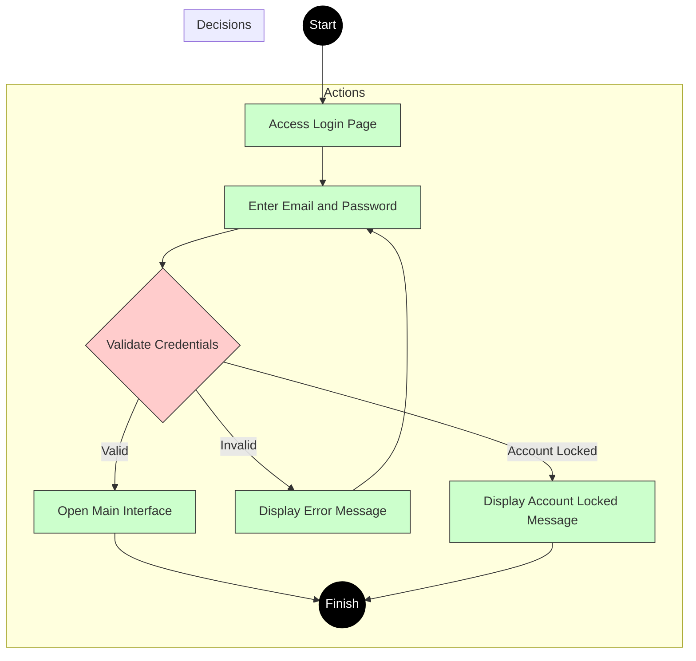
```mermaid
graph TD
    start((Start)) --> AccessLoginPage

    subgraph Actions
        AccessLoginPage[Access Login Page] --> EnterCredentials[Enter Email and Password]
        EnterCredentials --> ValidateCredentials
        MainInterface[Open Main Interface] --> finish((Finish))
        ErrorMessage[Display Error Message] --> EnterCredentials
        LockedMessage[Display Account Locked Message] --> finish
    end

    subgraph Decisions
        ValidateCredentials{Validate Credentials}
        ValidateCredentials -->|Valid| MainInterface
        ValidateCredentials -->|Invalid| ErrorMessage
        ValidateCredentials -->|Account Locked| LockedMessage
    end

    classDef decision fill:#ffcccc,stroke:#333,stroke-width:1px;
    classDef action fill:#ccffcc,stroke:#333,stroke-width:1px;
    classDef start fill:black,stroke:black,stroke-width:2px,color:white;
    classDef endnode fill:black,stroke:black,stroke-width:2px,color:white;

    class ValidateCredentials decision;
    class AccessLoginPage,EnterCredentials,MainInterface,ErrorMessage,LockedMessage action;
    class start start;
    class finish endnode;
```

## 2. Tìm kiếm sách (Search for Books)

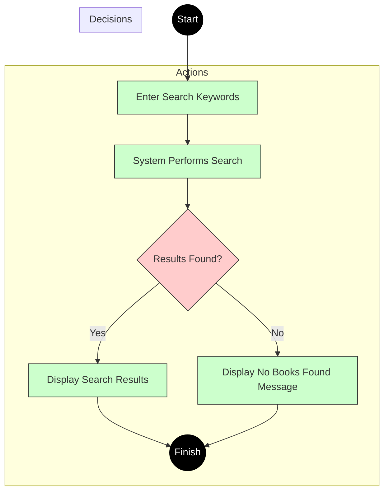
```mermaid
graph TD
    start((Start)) --> EnterSearchKeywords

    subgraph Actions
        EnterSearchKeywords[Enter Search Keywords] --> PerformingSearch[System Performs Search]
        PerformingSearch --> CheckResults
        DisplayResults[Display Search Results] --> finish((Finish))
        DisplayNoResults[Display No Books Found Message] --> finish
    end

    subgraph Decisions
        CheckResults{Results Found?}
        CheckResults -->|Yes| DisplayResults
        CheckResults -->|No| DisplayNoResults
    end

    classDef decision fill:#ffcccc,stroke:#333,stroke-width:1px;
    classDef action fill:#ccffcc,stroke:#333,stroke-width:1px;
    classDef start fill:black,stroke:black,stroke-width:2px,color:white;
    classDef endnode fill:black,stroke:black,stroke-width:2px,color:white;

    class CheckResults decision;
    class EnterSearchKeywords,PerformingSearch,DisplayResults,DisplayNoResults action;
    class start start;
    class finish endnode;
```

## 3. Xem chi tiết sách (View Book Details)

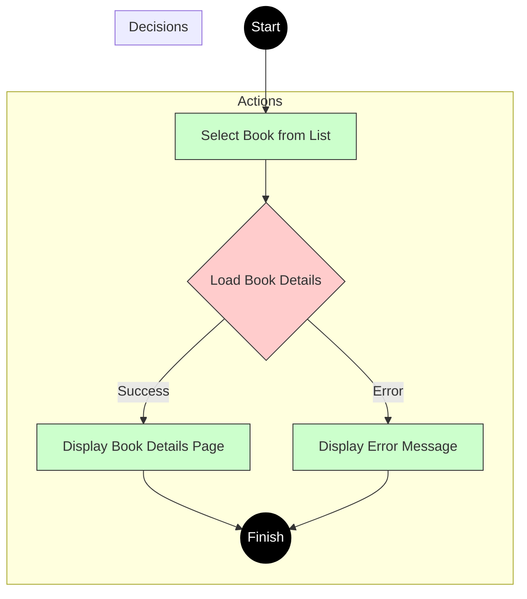
```mermaid
graph TD
    start((Start)) --> SelectBook

    subgraph Actions
        SelectBook[Select Book from List] --> LoadingDetails
        DisplayBookDetails[Display Book Details Page] --> finish((Finish))
        DisplayErrorMessage[Display Error Message] --> finish
    end

    subgraph Decisions
        LoadingDetails{Load Book Details}
        LoadingDetails -->|Success| DisplayBookDetails
        LoadingDetails -->|Error| DisplayErrorMessage
    end

    classDef decision fill:#ffcccc,stroke:#333,stroke-width:1px;
    classDef action fill:#ccffcc,stroke:#333,stroke-width:1px;
    classDef start fill:black,stroke:black,stroke-width:2px,color:white;
    classDef endnode fill:black,stroke:black,stroke-width:2px,color:white;

    class LoadingDetails decision;
    class SelectBook,DisplayBookDetails,DisplayErrorMessage action;
    class start start;
    class finish endnode;
```

## 4. Đánh giá sách (Rate Book)

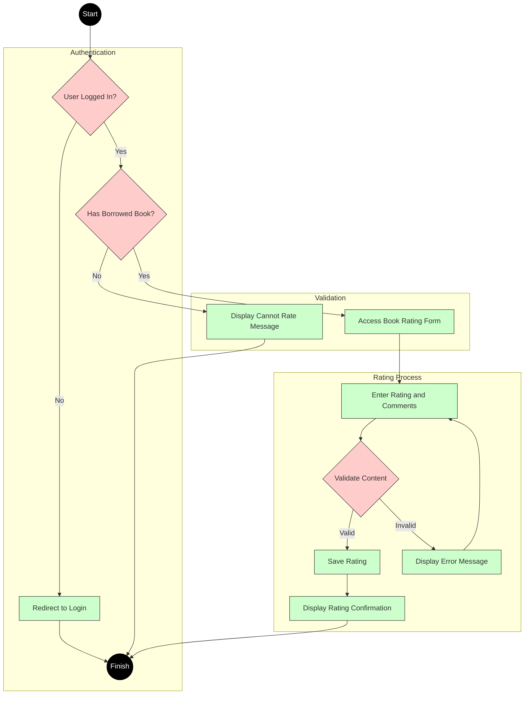
```mermaid
graph TD
    start((Start)) --> CheckLogin

    subgraph Authentication
        CheckLogin{User Logged In?}
        CheckLogin -->|No| RedirectToLogin[Redirect to Login]
        CheckLogin -->|Yes| CheckBorrowStatus
        RedirectToLogin --> finish((Finish))
    end

    subgraph Validation
        CheckBorrowStatus{Has Borrowed Book?}
        CheckBorrowStatus -->|No| CannotRate[Display Cannot Rate Message]
        CheckBorrowStatus -->|Yes| DisplayRatingForm
        CannotRate --> finish
    end

    subgraph Rating Process
        DisplayRatingForm[Access Book Rating Form] --> EnterRating
        EnterRating[Enter Rating and Comments] --> ValidateContent
        ValidateContent{Validate Content}
        ValidateContent -->|Valid| SaveRating
        ValidateContent -->|Invalid| DisplayError
        DisplayError[Display Error Message] --> EnterRating
        SaveRating[Save Rating] --> DisplayRatingSuccess
        DisplayRatingSuccess[Display Rating Confirmation] --> finish
    end

    classDef decision fill:#ffcccc,stroke:#333,stroke-width:1px;
    classDef action fill:#ccffcc,stroke:#333,stroke-width:1px;
    classDef start fill:black,stroke:black,stroke-width:2px,color:white;
    classDef endnode fill:black,stroke:black,stroke-width:2px,color:white;

    class CheckLogin,CheckBorrowStatus,ValidateContent decision;
    class RedirectToLogin,CannotRate,DisplayRatingForm,EnterRating,DisplayError,SaveRating,DisplayRatingSuccess action;
    class start start;
    class finish endnode;
```

## 5. Đặt trước sách (Reserve Book)

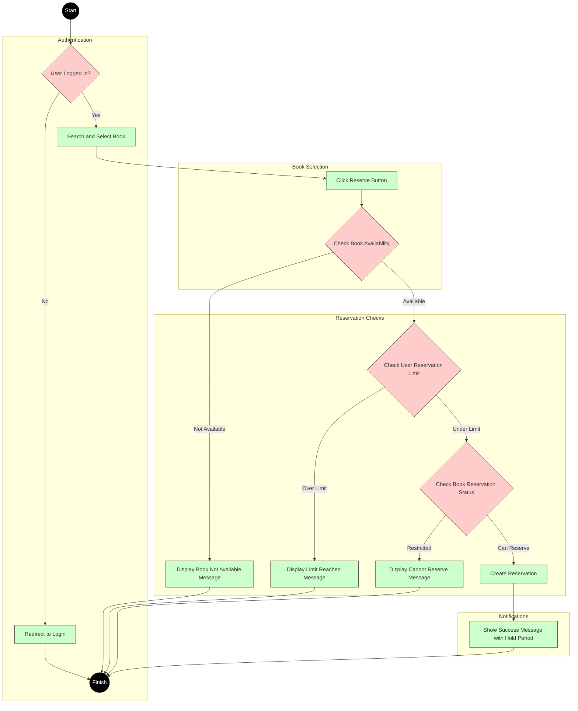
```mermaid
graph TD
    start((Start)) --> CheckLogin

    subgraph Authentication
        CheckLogin{User Logged In?}
        CheckLogin -->|No| RedirectToLogin[Redirect to Login]
        CheckLogin -->|Yes| SearchAndSelectBook
        RedirectToLogin --> finish((Finish))
    end

    subgraph Book Selection
        SearchAndSelectBook[Search and Select Book] --> ClickReserveButton
        ClickReserveButton[Click Reserve Button] --> CheckAvailability
    end

    subgraph Reservation Checks
        CheckAvailability{Check Book Availability}
        CheckAvailability -->|Available| CheckReservationLimit
        CheckAvailability -->|Not Available| DisplayNotAvailable

        CheckReservationLimit{Check User Reservation Limit}
        CheckReservationLimit -->|Under Limit| CheckReservationStatus
        CheckReservationLimit -->|Over Limit| DisplayLimitReached

        CheckReservationStatus{Check Book Reservation Status}
        CheckReservationStatus -->|Can Reserve| CreateReservation
        CheckReservationStatus -->|Restricted| DisplayCannotReserve
    end

    subgraph Notifications
        DisplayNotAvailable[Display Book Not Available Message] --> finish
        DisplayLimitReached[Display Limit Reached Message] --> finish
        DisplayCannotReserve[Display Cannot Reserve Message] --> finish
        CreateReservation[Create Reservation] --> DisplaySuccessMessage
        DisplaySuccessMessage[Show Success Message with Hold Period] --> finish
    end

    classDef decision fill:#ffcccc,stroke:#333,stroke-width:1px;
    classDef action fill:#ccffcc,stroke:#333,stroke-width:1px;
    classDef start fill:black,stroke:black,stroke-width:2px,color:white;
    classDef endnode fill:black,stroke:black,stroke-width:2px,color:white;

    class CheckLogin,CheckAvailability,CheckReservationLimit,CheckReservationStatus decision;
    class SearchAndSelectBook,ClickReserveButton,DisplayNotAvailable,DisplayLimitReached,DisplayCannotReserve,CreateReservation,DisplaySuccessMessage,RedirectToLogin action;
    class start start;
    class finish endnode;
```

## 6. Xem danh sách đặt trước (View Reserved Books)

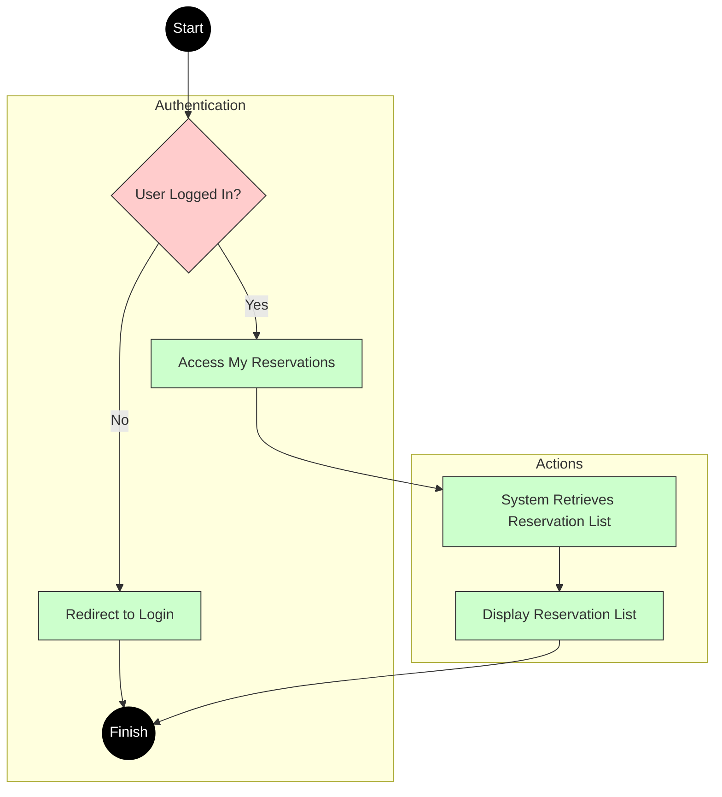
```mermaid
graph TD
    start((Start)) --> CheckLogin

    subgraph Authentication
        CheckLogin{User Logged In?}
        CheckLogin -->|No| RedirectToLogin[Redirect to Login]
        CheckLogin -->|Yes| AccessReservations
        RedirectToLogin --> finish((Finish))
    end

    subgraph Actions
        AccessReservations[Access My Reservations] --> RetrievingReservations
        RetrievingReservations[System Retrieves Reservation List] --> DisplayReservationList
        DisplayReservationList[Display Reservation List] --> finish
    end

    classDef decision fill:#ffcccc,stroke:#333,stroke-width:1px;
    classDef action fill:#ccffcc,stroke:#333,stroke-width:1px;
    classDef start fill:black,stroke:black,stroke-width:2px,color:white;
    classDef endnode fill:black,stroke:black,stroke-width:2px,color:white;

    class CheckLogin decision;
    class RedirectToLogin,AccessReservations,RetrievingReservations,DisplayReservationList action;
    class start start;
    class finish endnode;
```

## 7. Mượn sách từ đặt trước (Borrow Reserved Book)

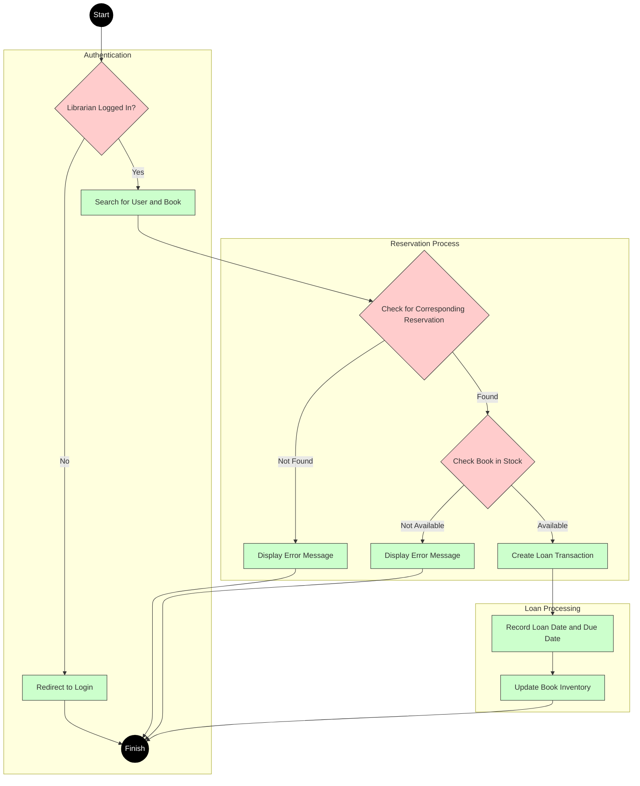
```mermaid
graph TD
    start((Start)) --> CheckLibrarianLogin

    subgraph Authentication
        CheckLibrarianLogin{Librarian Logged In?}
        CheckLibrarianLogin -->|No| RedirectToLogin[Redirect to Login]
        CheckLibrarianLogin -->|Yes| SearchUserAndBook
        RedirectToLogin --> finish((Finish))
    end

    subgraph Reservation Process
        SearchUserAndBook[Search for User and Book] --> CheckReservation

        CheckReservation{Check for Corresponding Reservation}
        CheckReservation -->|Found| CheckBookStock
        CheckReservation -->|Not Found| DisplayError

        DisplayError[Display Error Message] --> finish

        CheckBookStock{Check Book in Stock}
        CheckBookStock -->|Available| CreateLoanTransaction
        CheckBookStock -->|Not Available| DisplayNotAvailableError

        DisplayNotAvailableError[Display Error Message] --> finish
    end

    subgraph Loan Processing
        CreateLoanTransaction[Create Loan Transaction] --> RecordDates
        RecordDates[Record Loan Date and Due Date] --> UpdateInventory
        UpdateInventory[Update Book Inventory] --> finish
    end

    classDef decision fill:#ffcccc,stroke:#333,stroke-width:1px;
    classDef action fill:#ccffcc,stroke:#333,stroke-width:1px;
    classDef start fill:black,stroke:black,stroke-width:2px,color:white;
    classDef endnode fill:black,stroke:black,stroke-width:2px,color:white;

    class CheckLibrarianLogin,CheckReservation,CheckBookStock decision;
    class SearchUserAndBook,DisplayError,DisplayNotAvailableError,CreateLoanTransaction,RecordDates,UpdateInventory,RedirectToLogin action;
    class start start;
    class finish endnode;
```

## 8. Mượn sách (Borrow Book)

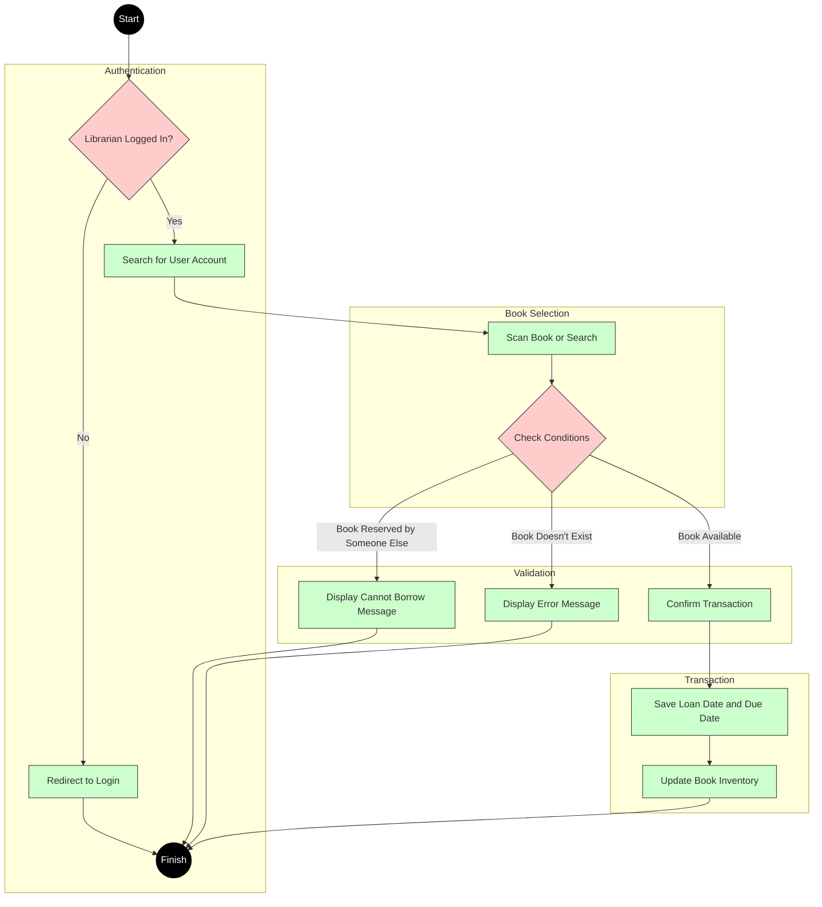
```mermaid
graph TD
    start((Start)) --> CheckLibrarianLogin

    subgraph Authentication
        CheckLibrarianLogin{Librarian Logged In?}
        CheckLibrarianLogin -->|No| RedirectToLogin[Redirect to Login]
        CheckLibrarianLogin -->|Yes| SearchUserAccount
        RedirectToLogin --> finish((Finish))
    end

    subgraph Book Selection
        SearchUserAccount[Search for User Account] --> ScanOrSearchBook
        ScanOrSearchBook[Scan Book or Search] --> CheckConditions
    end

    subgraph Validation
        CheckConditions{Check Conditions}
        CheckConditions -->|Book Reserved by Someone Else| DisplayCannotBorrow
        CheckConditions -->|Book Doesn't Exist| DisplayErrorMessage
        CheckConditions -->|Book Available| ConfirmTransaction

        DisplayCannotBorrow[Display Cannot Borrow Message] --> finish
        DisplayErrorMessage[Display Error Message] --> finish
    end

    subgraph Transaction
        ConfirmTransaction[Confirm Transaction] --> SaveLoanDetails
        SaveLoanDetails[Save Loan Date and Due Date] --> UpdateInventory
        UpdateInventory[Update Book Inventory] --> finish
    end

    classDef decision fill:#ffcccc,stroke:#333,stroke-width:1px;
    classDef action fill:#ccffcc,stroke:#333,stroke-width:1px;
    classDef start fill:black,stroke:black,stroke-width:2px,color:white;
    classDef endnode fill:black,stroke:black,stroke-width:2px,color:white;

    class CheckLibrarianLogin,CheckConditions decision;
    class SearchUserAccount,ScanOrSearchBook,DisplayCannotBorrow,DisplayErrorMessage,ConfirmTransaction,SaveLoanDetails,UpdateInventory,RedirectToLogin action;
    class start start;
    class finish endnode;
```

## 9. Trả sách (Return Book)

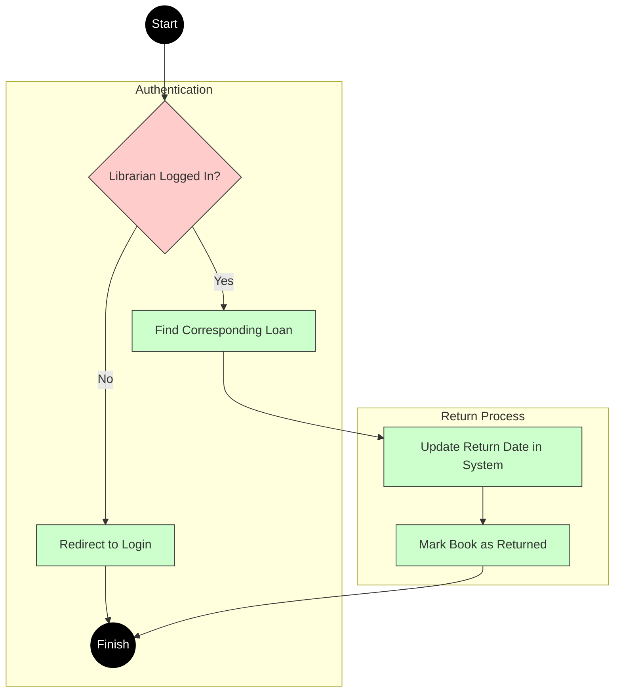
```mermaid
graph TD
    start((Start)) --> CheckLibrarianLogin

    subgraph Authentication
        CheckLibrarianLogin{Librarian Logged In?}
        CheckLibrarianLogin -->|No| RedirectToLogin[Redirect to Login]
        CheckLibrarianLogin -->|Yes| FindLoan
        RedirectToLogin --> finish((Finish))
    end

    subgraph Return Process
        FindLoan[Find Corresponding Loan] --> UpdateReturnDate
        UpdateReturnDate[Update Return Date in System] --> MarkBookAsReturned
        MarkBookAsReturned[Mark Book as Returned] --> finish
    end

    classDef decision fill:#ffcccc,stroke:#333,stroke-width:1px;
    classDef action fill:#ccffcc,stroke:#333,stroke-width:1px;
    classDef start fill:black,stroke:black,stroke-width:2px,color:white;
    classDef endnode fill:black,stroke:black,stroke-width:2px,color:white;

    class CheckLibrarianLogin decision;
    class FindLoan,UpdateReturnDate,MarkBookAsReturned,RedirectToLogin action;
    class start start;
    class finish endnode;
```

## 10. Đánh giá tình trạng sách sau khi trả (Assess Book Condition)

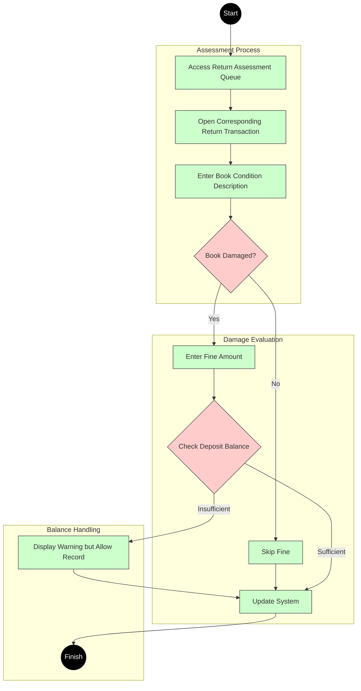
```mermaid
graph TD
    start((Start)) --> AccessAssessmentQueue

    subgraph Assessment Process
        AccessAssessmentQueue[Access Return Assessment Queue] --> OpenReturnTransaction
        OpenReturnTransaction[Open Corresponding Return Transaction] --> EnterBookCondition
        EnterBookCondition[Enter Book Condition Description] --> CheckDamage
    end

    subgraph Damage Evaluation
        CheckDamage{Book Damaged?}
        CheckDamage -->|Yes| EnterFineAmount
        CheckDamage -->|No| SkipFine

        EnterFineAmount[Enter Fine Amount] --> CheckDepositBalance
        SkipFine[Skip Fine] --> UpdateSystem
    end

    subgraph Balance Handling
        CheckDepositBalance{Check Deposit Balance}
        CheckDepositBalance -->|Sufficient| UpdateSystem
        CheckDepositBalance -->|Insufficient| DisplayWarning

        DisplayWarning[Display Warning but Allow Record] --> UpdateSystem
        UpdateSystem[Update System] --> finish((Finish))
    end

    classDef decision fill:#ffcccc,stroke:#333,stroke-width:1px;
    classDef action fill:#ccffcc,stroke:#333,stroke-width:1px;
    classDef start fill:black,stroke:black,stroke-width:2px,color:white;
    classDef endnode fill:black,stroke:black,stroke-width:2px,color:white;

    class CheckDamage,CheckDepositBalance decision;
    class AccessAssessmentQueue,OpenReturnTransaction,EnterBookCondition,EnterFineAmount,SkipFine,DisplayWarning,UpdateSystem action;
    class start start;
    class finish endnode;
```

## 11. Kiểm tra trạng thái trả sách (Check Return Status)

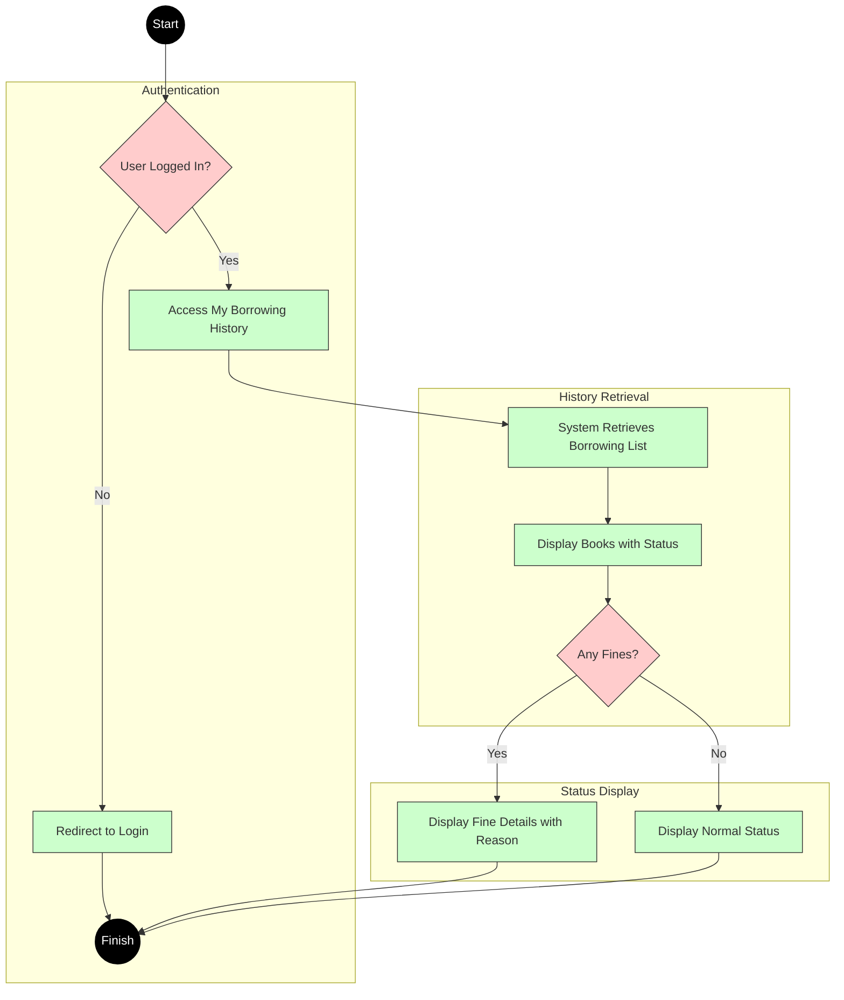
```mermaid
graph TD
    start((Start)) --> CheckLogin

    subgraph Authentication
        CheckLogin{User Logged In?}
        CheckLogin -->|No| RedirectToLogin[Redirect to Login]
        CheckLogin -->|Yes| AccessBorrowingHistory
        RedirectToLogin --> finish((Finish))
    end

    subgraph History Retrieval
        AccessBorrowingHistory[Access My Borrowing History] --> RetrieveBorrowingList
        RetrieveBorrowingList[System Retrieves Borrowing List] --> DisplayBooksWithStatus
        DisplayBooksWithStatus[Display Books with Status] --> CheckFines
    end

    subgraph Status Display
        CheckFines{Any Fines?}
        CheckFines -->|Yes| DisplayFineDetails
        CheckFines -->|No| CompleteStatus

        DisplayFineDetails[Display Fine Details with Reason] --> finish
        CompleteStatus[Display Normal Status] --> finish
    end

    classDef decision fill:#ffcccc,stroke:#333,stroke-width:1px;
    classDef action fill:#ccffcc,stroke:#333,stroke-width:1px;
    classDef start fill:black,stroke:black,stroke-width:2px,color:white;
    classDef endnode fill:black,stroke:black,stroke-width:2px,color:white;

    class CheckLogin,CheckFines decision;
    class RedirectToLogin,AccessBorrowingHistory,RetrieveBorrowingList,DisplayBooksWithStatus,DisplayFineDetails,CompleteStatus action;
    class start start;
    class finish endnode;
```

## 12. Xem số dư tiền cọc (View Deposit Balance)

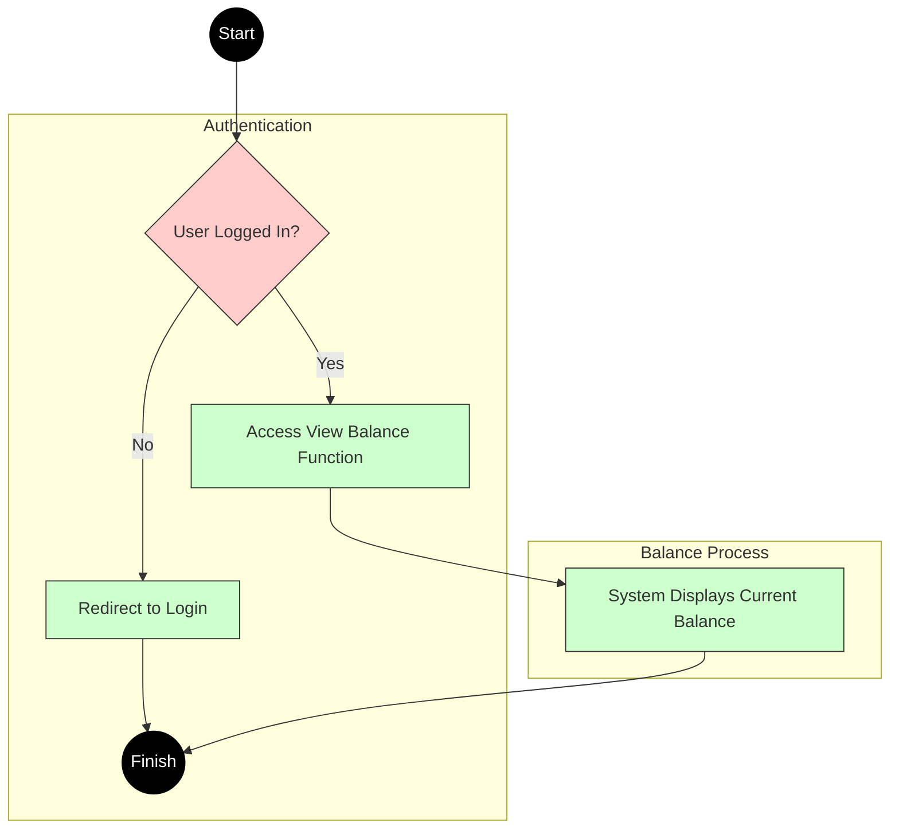
```mermaid
graph TD
    start((Start)) --> CheckLogin

    subgraph Authentication
        CheckLogin{User Logged In?}
        CheckLogin -->|No| RedirectToLogin[Redirect to Login]
        CheckLogin -->|Yes| AccessViewBalance
        RedirectToLogin --> finish((Finish))
    end

    subgraph Balance Process
        AccessViewBalance[Access View Balance Function] --> DisplayCurrentBalance
        DisplayCurrentBalance[System Displays Current Balance] --> finish
    end

    classDef decision fill:#ffcccc,stroke:#333,stroke-width:1px;
    classDef action fill:#ccffcc,stroke:#333,stroke-width:1px;
    classDef start fill:black,stroke:black,stroke-width:2px,color:white;
    classDef endnode fill:black,stroke:black,stroke-width:2px,color:white;

    class CheckLogin decision;
    class RedirectToLogin,AccessViewBalance,DisplayCurrentBalance action;
    class start start;
    class finish endnode;
```

## 13. Nạp/Rút tiền cọc (Deposit/Withdraw)

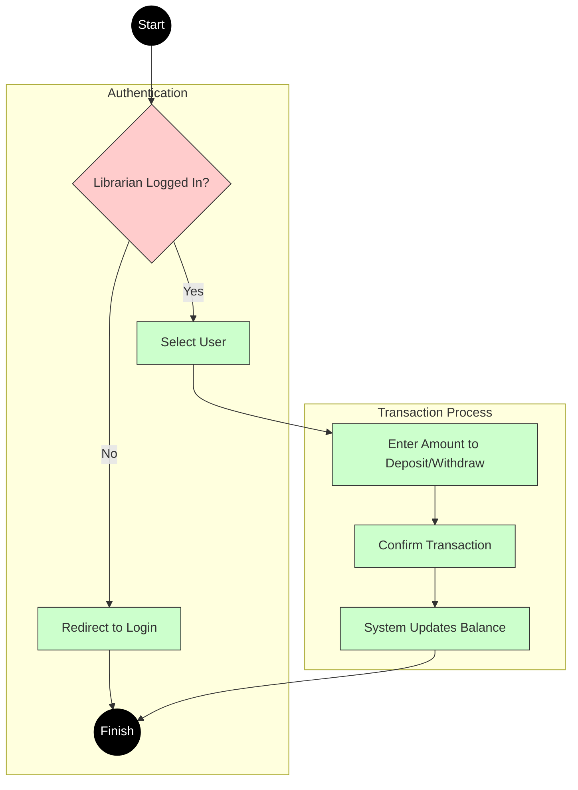
```mermaid
graph TD
    start((Start)) --> CheckLibrarianLogin

    subgraph Authentication
        CheckLibrarianLogin{Librarian Logged In?}
        CheckLibrarianLogin -->|No| RedirectToLogin[Redirect to Login]
        CheckLibrarianLogin -->|Yes| SelectUser
        RedirectToLogin --> finish((Finish))
    end

    subgraph Transaction Process
        SelectUser[Select User] --> EnterAmount
        EnterAmount[Enter Amount to Deposit/Withdraw] --> ConfirmTransaction
        ConfirmTransaction[Confirm Transaction] --> UpdateSystemBalance
        UpdateSystemBalance[System Updates Balance] --> finish
    end

    classDef decision fill:#ffcccc,stroke:#333,stroke-width:1px;
    classDef action fill:#ccffcc,stroke:#333,stroke-width:1px;
    classDef start fill:black,stroke:black,stroke-width:2px,color:white;
    classDef endnode fill:black,stroke:black,stroke-width:2px,color:white;

    class CheckLibrarianLogin decision;
    class RedirectToLogin,SelectUser,EnterAmount,ConfirmTransaction,UpdateSystemBalance action;
    class start start;
    class finish endnode;
```

## 14. Gửi câu hỏi (Send Question)

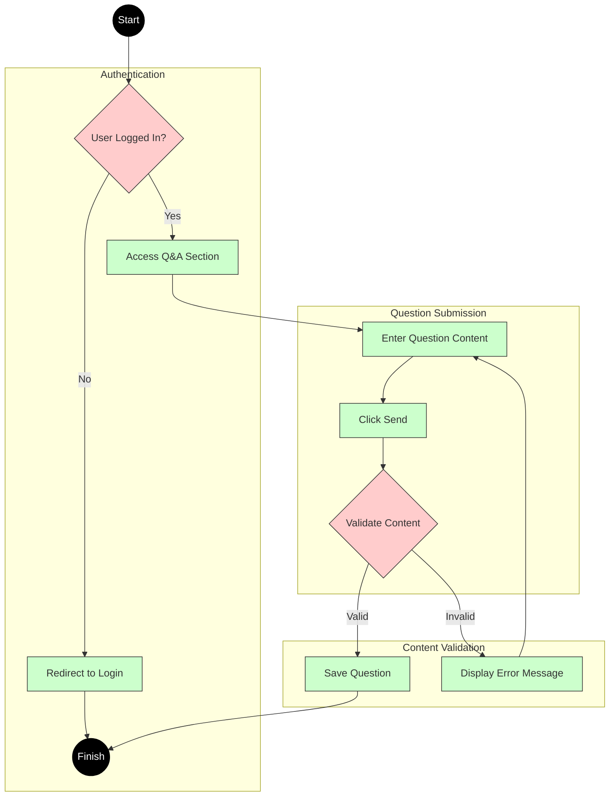
```mermaid
graph TD
    start((Start)) --> CheckLogin

    subgraph Authentication
        CheckLogin{User Logged In?}
        CheckLogin -->|No| RedirectToLogin[Redirect to Login]
        CheckLogin -->|Yes| AccessQASection
        RedirectToLogin --> finish((Finish))
    end

    subgraph Question Submission
        AccessQASection[Access Q&A Section] --> EnterQuestionContent
        EnterQuestionContent[Enter Question Content] --> ClickSend
        ClickSend[Click Send] --> ValidateContent
    end

    subgraph Content Validation
        ValidateContent{Validate Content}
        ValidateContent -->|Valid| SaveQuestion
        ValidateContent -->|Invalid| DisplayError

        DisplayError[Display Error Message] --> EnterQuestionContent
        SaveQuestion[Save Question] --> finish
    end

    classDef decision fill:#ffcccc,stroke:#333,stroke-width:1px;
    classDef action fill:#ccffcc,stroke:#333,stroke-width:1px;
    classDef start fill:black,stroke:black,stroke-width:2px,color:white;
    classDef endnode fill:black,stroke:black,stroke-width:2px,color:white;

    class CheckLogin,ValidateContent decision;
    class RedirectToLogin,AccessQASection,EnterQuestionContent,ClickSend,DisplayError,SaveQuestion action;
    class start start;
    class finish endnode;
```

## 15. Phản hồi câu hỏi (Respond to Question)

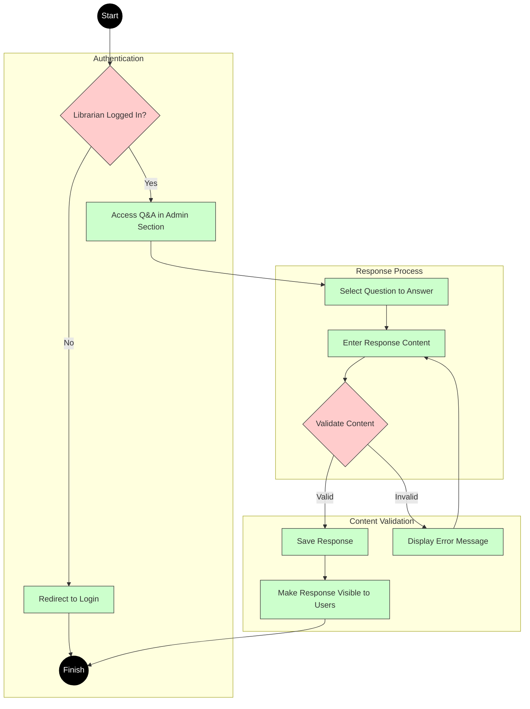
```mermaid
graph TD
    start((Start)) --> CheckLibrarianLogin

    subgraph Authentication
        CheckLibrarianLogin{Librarian Logged In?}
        CheckLibrarianLogin -->|No| RedirectToLogin[Redirect to Login]
        CheckLibrarianLogin -->|Yes| AccessQAAdmin
        RedirectToLogin --> finish((Finish))
    end

    subgraph Response Process
        AccessQAAdmin[Access Q&A in Admin Section] --> SelectQuestion
        SelectQuestion[Select Question to Answer] --> EnterResponseContent
        EnterResponseContent[Enter Response Content] --> ValidateContent
    end

    subgraph Content Validation
        ValidateContent{Validate Content}
        ValidateContent -->|Valid| SaveResponse
        ValidateContent -->|Invalid| DisplayError

        DisplayError[Display Error Message] --> EnterResponseContent
        SaveResponse[Save Response] --> MakeResponseVisible
        MakeResponseVisible[Make Response Visible to Users] --> finish
    end

    classDef decision fill:#ffcccc,stroke:#333,stroke-width:1px;
    classDef action fill:#ccffcc,stroke:#333,stroke-width:1px;
    classDef start fill:black,stroke:black,stroke-width:2px,color:white;
    classDef endnode fill:black,stroke:black,stroke-width:2px,color:white;

    class CheckLibrarianLogin,ValidateContent decision;
    class RedirectToLogin,AccessQAAdmin,SelectQuestion,EnterResponseContent,DisplayError,SaveResponse,MakeResponseVisible action;
    class start start;
    class finish endnode;
```

## 16. Xoá câu hỏi (Delete Question)

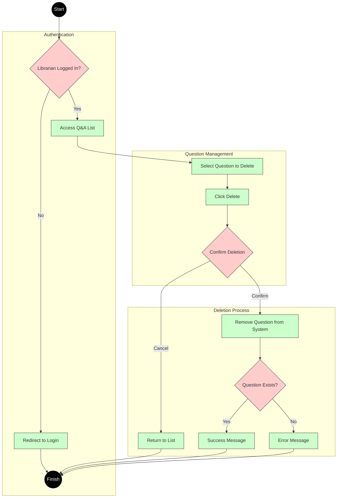
```mermaid
graph TD
    start((Start)) --> CheckLibrarianLogin

    subgraph Authentication
        CheckLibrarianLogin{Librarian Logged In?}
        CheckLibrarianLogin -->|No| RedirectToLogin[Redirect to Login]
        CheckLibrarianLogin -->|Yes| AccessQAList
        RedirectToLogin --> finish((Finish))
    end

    subgraph Question Management
        AccessQAList[Access Q&A List] --> SelectQuestion
        SelectQuestion[Select Question to Delete] --> ClickDelete
        ClickDelete[Click Delete] --> ConfirmDeletion
    end

    subgraph Deletion Process
        ConfirmDeletion{Confirm Deletion}
        ConfirmDeletion -->|Confirm| RemoveQuestion
        ConfirmDeletion -->|Cancel| ReturnToList

        ReturnToList[Return to List] --> finish
        RemoveQuestion[Remove Question from System] --> CheckExistence

        CheckExistence{Question Exists?}
        CheckExistence -->|Yes| DisplaySuccessMessage
        CheckExistence -->|No| DisplayErrorMessage

        DisplaySuccessMessage[Success Message] --> finish
        DisplayErrorMessage[Error Message] --> finish
    end

    classDef decision fill:#ffcccc,stroke:#333,stroke-width:1px;
    classDef action fill:#ccffcc,stroke:#333,stroke-width:1px;
    classDef start fill:black,stroke:black,stroke-width:2px,color:white;
    classDef endnode fill:black,stroke:black,stroke-width:2px,color:white;

    class CheckLibrarianLogin,ConfirmDeletion,CheckExistence decision;
    class RedirectToLogin,AccessQAList,SelectQuestion,ClickDelete,RemoveQuestion,ReturnToList,DisplaySuccessMessage,DisplayErrorMessage action;
    class start start;
    class finish endnode;
```

## 17. Xoá đánh giá (Delete Rating)

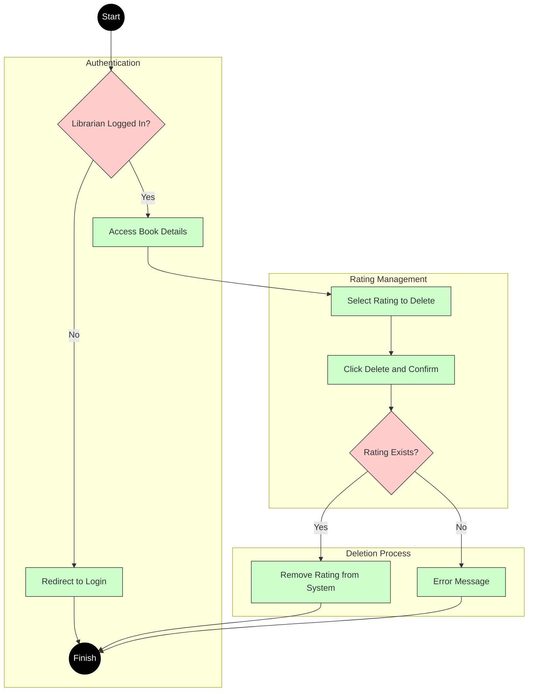
```mermaid
graph TD
    start((Start)) --> CheckLibrarianLogin

    subgraph Authentication
        CheckLibrarianLogin{Librarian Logged In?}
        CheckLibrarianLogin -->|No| RedirectToLogin[Redirect to Login]
        CheckLibrarianLogin -->|Yes| AccessBookDetails
        RedirectToLogin --> finish((Finish))
    end

    subgraph Rating Management
        AccessBookDetails[Access Book Details] --> SelectRating
        SelectRating[Select Rating to Delete] --> ClickDeleteAndConfirm
        ClickDeleteAndConfirm[Click Delete and Confirm] --> CheckRatingExists
    end

    subgraph Deletion Process
        CheckRatingExists{Rating Exists?}
        CheckRatingExists -->|Yes| RemoveRating
        CheckRatingExists -->|No| DisplayErrorMessage

        RemoveRating[Remove Rating from System] --> finish
        DisplayErrorMessage[Error Message] --> finish
    end

    classDef decision fill:#ffcccc,stroke:#333,stroke-width:1px;
    classDef action fill:#ccffcc,stroke:#333,stroke-width:1px;
    classDef start fill:black,stroke:black,stroke-width:2px,color:white;
    classDef endnode fill:black,stroke:black,stroke-width:2px,color:white;

    class CheckLibrarianLogin,CheckRatingExists decision;
    class RedirectToLogin,AccessBookDetails,SelectRating,ClickDeleteAndConfirm,RemoveRating,DisplayErrorMessage action;
    class start start;
    class finish endnode;
```

## 18. Quản lý sách (Manage Books)

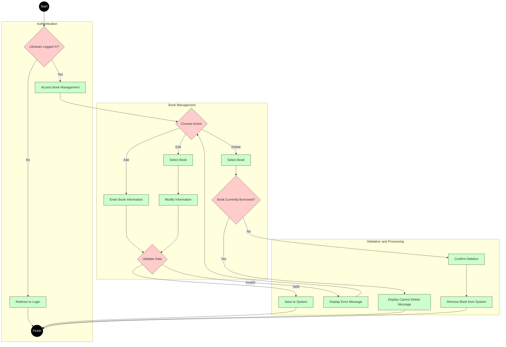
```mermaid
graph TD
    start((Start)) --> CheckLibrarianLogin

    subgraph Authentication
        CheckLibrarianLogin{Librarian Logged In?}
        CheckLibrarianLogin -->|No| RedirectToLogin[Redirect to Login]
        CheckLibrarianLogin -->|Yes| AccessBookManagement
        RedirectToLogin --> finish((Finish))
    end

    subgraph Book Management
        AccessBookManagement[Access Book Management] --> ChooseAction

        ChooseAction{Choose Action}
        ChooseAction -->|Add| EnterBookInformation
        ChooseAction -->|Edit| SelectExistingBook
        ChooseAction -->|Delete| SelectBookToDelete

        EnterBookInformation[Enter Book Information] --> ValidateData
        SelectExistingBook[Select Book] --> ModifyInformation
        ModifyInformation[Modify Information] --> ValidateData
        SelectBookToDelete[Select Book] --> CheckIfBorrowed
    end

    subgraph Validation and Processing
        ValidateData{Validate Data}
        ValidateData -->|Valid| SaveToSystem
        ValidateData -->|Invalid| DisplayErrorMessage

        DisplayErrorMessage[Display Error Message] --> ChooseAction
        SaveToSystem[Save to System] --> finish

        CheckIfBorrowed{Book Currently Borrowed?}
        CheckIfBorrowed -->|Yes| DisplayCannotDelete
        CheckIfBorrowed -->|No| ConfirmDeletion

        DisplayCannotDelete[Display Cannot Delete Message] --> finish
        ConfirmDeletion[Confirm Deletion] --> RemoveBook
        RemoveBook[Remove Book from System] --> finish
    end

    classDef decision fill:#ffcccc,stroke:#333,stroke-width:1px;
    classDef action fill:#ccffcc,stroke:#333,stroke-width:1px;
    classDef start fill:black,stroke:black,stroke-width:2px,color:white;
    classDef endnode fill:black,stroke:black,stroke-width:2px,color:white;

    class CheckLibrarianLogin,ChooseAction,ValidateData,CheckIfBorrowed decision;
    class RedirectToLogin,AccessBookManagement,EnterBookInformation,SelectExistingBook,ModifyInformation,SelectBookToDelete,DisplayErrorMessage,SaveToSystem,DisplayCannotDelete,ConfirmDeletion,RemoveBook action;
    class start start;
    class finish endnode;
```

## 19. Quản lý tác giả (Manage Authors)

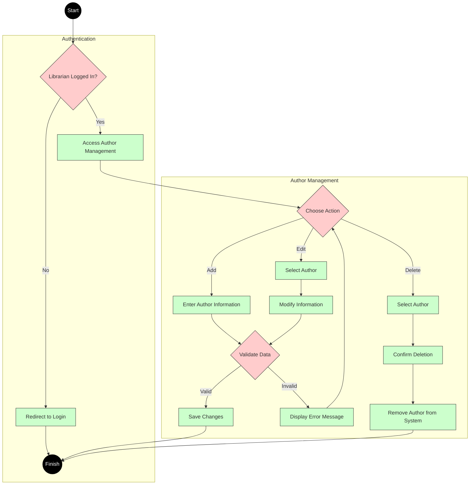
```mermaid
graph TD
    start((Start)) --> CheckLibrarianLogin

    subgraph Authentication
        CheckLibrarianLogin{Librarian Logged In?}
        CheckLibrarianLogin -->|No| RedirectToLogin[Redirect to Login]
        CheckLibrarianLogin -->|Yes| AccessAuthorManagement
        RedirectToLogin --> finish((Finish))
    end

    subgraph Author Management
        AccessAuthorManagement[Access Author Management] --> ChooseAction

        ChooseAction{Choose Action}
        ChooseAction -->|Add| EnterAuthorInformation
        ChooseAction -->|Edit| SelectExistingAuthor
        ChooseAction -->|Delete| SelectAuthorToDelete

        EnterAuthorInformation[Enter Author Information] --> ValidateData
        SelectExistingAuthor[Select Author] --> ModifyInformation
        ModifyInformation[Modify Information] --> ValidateData
        SelectAuthorToDelete[Select Author] --> ConfirmDeletion

        ValidateData{Validate Data}
        ValidateData -->|Valid| SaveChanges
        ValidateData -->|Invalid| DisplayErrorMessage

        DisplayErrorMessage[Display Error Message] --> ChooseAction
        ConfirmDeletion[Confirm Deletion] --> RemoveAuthor

        SaveChanges[Save Changes] --> finish
        RemoveAuthor[Remove Author from System] --> finish
    end

    classDef decision fill:#ffcccc,stroke:#333,stroke-width:1px;
    classDef action fill:#ccffcc,stroke:#333,stroke-width:1px;
    classDef start fill:black,stroke:black,stroke-width:2px,color:white;
    classDef endnode fill:black,stroke:black,stroke-width:2px,color:white;

    class CheckLibrarianLogin,ChooseAction,ValidateData decision;
    class AccessAuthorManagement,EnterAuthorInformation,SelectExistingAuthor,ModifyInformation,SelectAuthorToDelete,DisplayErrorMessage,ConfirmDeletion,SaveChanges,RemoveAuthor,RedirectToLogin action;
    class start start;
    class finish endnode;
```

## 20. Quản lý danh mục (Manage Categories)

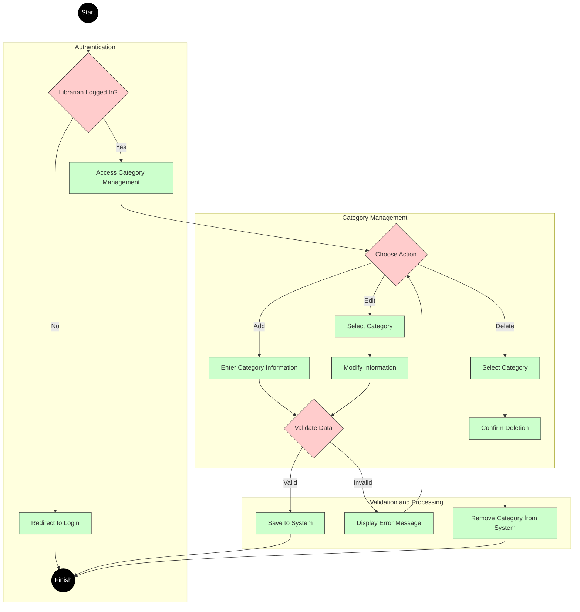
```mermaid
graph TD
    start((Start)) --> CheckLibrarianLogin

    subgraph Authentication
        CheckLibrarianLogin{Librarian Logged In?}
        CheckLibrarianLogin -->|No| RedirectToLogin[Redirect to Login]
        CheckLibrarianLogin -->|Yes| AccessCategoryManagement
        RedirectToLogin --> finish((Finish))
    end

    subgraph Category Management
        AccessCategoryManagement[Access Category Management] --> ChooseAction

        ChooseAction{Choose Action}
        ChooseAction -->|Add| EnterCategoryInformation
        ChooseAction -->|Edit| SelectExistingCategory
        ChooseAction -->|Delete| SelectCategoryToDelete

        EnterCategoryInformation[Enter Category Information] --> ValidateData
        SelectExistingCategory[Select Category] --> ModifyInformation
        ModifyInformation[Modify Information] --> ValidateData
        SelectCategoryToDelete[Select Category] --> ConfirmDeletion
    end

    subgraph Validation and Processing
        ValidateData{Validate Data}
        ValidateData -->|Valid| SaveToSystem
        ValidateData -->|Invalid| DisplayErrorMessage

        DisplayErrorMessage[Display Error Message] --> ChooseAction
        SaveToSystem[Save to System] --> finish

        ConfirmDeletion[Confirm Deletion] --> RemoveCategory
        RemoveCategory[Remove Category from System] --> finish
    end

    classDef decision fill:#ffcccc,stroke:#333,stroke-width:1px;
    classDef action fill:#ccffcc,stroke:#333,stroke-width:1px;
    classDef start fill:black,stroke:black,stroke-width:2px,color:white;
    classDef endnode fill:black,stroke:black,stroke-width:2px,color:white;

    class CheckLibrarianLogin,ChooseAction,ValidateData decision;
    class RedirectToLogin,AccessCategoryManagement,EnterCategoryInformation,SelectExistingCategory,ModifyInformation,SelectCategoryToDelete,DisplayErrorMessage,ConfirmDeletion,SaveToSystem,RemoveCategory action;
    class start start;
    class finish endnode;
```

## 21. Quản lý người dùng (Manage Users)

```mermaid
graph TD
    start((Start)) --> CheckLibrarianAdminLogin

    subgraph Authentication
        CheckLibrarianAdminLogin{Librarian Admin Logged In?}
        CheckLibrarianAdminLogin -->|No| RedirectToLogin[Redirect to Login]
        CheckLibrarianAdminLogin -->|Yes| AccessUserManagement
        RedirectToLogin --> finish((Finish))
    end

    subgraph User Management
        AccessUserManagement[Access User Management] --> ChooseAction

        ChooseAction{Choose Action}
        ChooseAction -->|Add| EnterUserInformation
        ChooseAction -->|Edit| SelectUser
        ChooseAction -->|Disable| SelectUserToDisable

        EnterUserInformation[Enter User Information] --> RecordInitialDeposit
        RecordInitialDeposit[Record Initial Deposit] --> ValidateData

        SelectUser[Select User] --> ModifyInformation
        ModifyInformation[Modify Information] --> ValidateData

        SelectUserToDisable[Select User to Disable] --> ConfirmDisabling
        ConfirmDisabling[Confirm Disabling] --> ChangeUserStatus
    end

    subgraph Validation and Processing
        ValidateData{Validate Data}
        ValidateData -->|Valid| SaveToSystem
        ValidateData -->|Invalid| DisplayErrorMessage

        DisplayErrorMessage[Display Error Message] --> ChooseAction
        SaveToSystem[Save to System] --> finish
        ChangeUserStatus[Change User Status] --> finish
    end

    classDef decision fill:#ffcccc,stroke:#333,stroke-width:1px;
    classDef action fill:#ccffcc,stroke:#333,stroke-width:1px;
    classDef start fill:black,stroke:black,stroke-width:2px,color:white;
    classDef endnode fill:black,stroke:black,stroke-width:2px,color:white;

    class CheckLibrarianAdminLogin,ChooseAction,ValidateData decision;
    class RedirectToLogin,AccessUserManagement,EnterUserInformation,RecordInitialDeposit,SelectUser,ModifyInformation,SelectUserToDisable,ConfirmDisabling,DisplayErrorMessage,SaveToSystem,ChangeUserStatus action;
    class start start;
    class finish endnode;
```

## 22. Quản lý thủ thư (Manage Librarians)

```mermaid
graph TD
    start((Start)) --> CheckAdminLogin

    subgraph Authentication
        CheckAdminLogin{Admin Logged In?}
        CheckAdminLogin -->|No| RedirectToLogin[Redirect to Login]
        CheckAdminLogin -->|Yes| AccessUserList
        RedirectToLogin --> finish((Finish))
    end

    subgraph User Permission Management
        AccessUserList[Access User List] --> SelectUserToChangePermissions
        SelectUserToChangePermissions[Select User to Change Permissions] --> ChooseAction

        ChooseAction{Choose Action}
        ChooseAction -->|Grant Role| CheckIfAlreadyLibrarian
        ChooseAction -->|Revoke Role| CheckIfLibrarian

        CheckIfAlreadyLibrarian{Is User Already Librarian?}
        CheckIfAlreadyLibrarian -->|Yes| DisplayErrorMessage
        CheckIfAlreadyLibrarian -->|No| UpdateToLibrarian

        CheckIfLibrarian{Is User a Librarian?}
        CheckIfLibrarian -->|Yes| RemoveLibrarianRole
        CheckIfLibrarian -->|No| DisplayErrorMessage2
    end

    subgraph Action Results
        UpdateToLibrarian[Update to Librarian Role] --> finish
        RemoveLibrarianRole[Remove Librarian Role] --> finish
        DisplayErrorMessage[Display Error Message] --> finish
        DisplayErrorMessage2[Display Error Message] --> finish
    end

    classDef decision fill:#ffcccc,stroke:#333,stroke-width:1px;
    classDef action fill:#ccffcc,stroke:#333,stroke-width:1px;
    classDef start fill:black,stroke:black,stroke-width:2px,color:white;
    classDef endnode fill:black,stroke:black,stroke-width:2px,color:white;

    class CheckAdminLogin,ChooseAction,CheckIfAlreadyLibrarian,CheckIfLibrarian decision;
    class RedirectToLogin,AccessUserList,SelectUserToChangePermissions,UpdateToLibrarian,RemoveLibrarianRole,DisplayErrorMessage,DisplayErrorMessage2 action;
    class start start;
    class finish endnode;
```

## 23. Xem thống kê (View Statistics)

```mermaid
graph TD
    start((Start)) --> CheckLibrarianAdminLogin

    subgraph Authentication
        CheckLibrarianAdminLogin{Librarian/Admin Logged In?}
        CheckLibrarianAdminLogin -->|No| RedirectToLogin[Redirect to Login]
        CheckLibrarianAdminLogin -->|Yes| AccessStatistics
        RedirectToLogin --> finish((Finish))
    end

    subgraph Statistics Selection
        AccessStatistics[Access Statistics] --> SelectStatisticsType

        SelectStatisticsType{Select Statistics Type}
        SelectStatisticsType -->|Books| DisplayBookStatistics
        SelectStatisticsType -->|Categories| DisplayCategoryStatistics
        SelectStatisticsType -->|Publishers| DisplayPublisherStatistics

        DisplayBookStatistics[Display Book Statistics] --> CheckDataAvailable
        DisplayCategoryStatistics[Display Category Statistics] --> CheckDataAvailable
        DisplayPublisherStatistics[Display Publisher Statistics] --> CheckDataAvailable
    end

    subgraph Data Display
        CheckDataAvailable{Data Available?}
        CheckDataAvailable -->|Yes| DisplayDataInTable
        CheckDataAvailable -->|No| DisplayNoDataMessage

        DisplayNoDataMessage[Display No Data Message] --> finish
        DisplayDataInTable[Display Data in Table] --> CheckExportOption
    end

    subgraph Export Options
        CheckExportOption{Export Data?}
        CheckExportOption -->|Yes| GenerateAndDownload
        CheckExportOption -->|No| finish

        GenerateAndDownload[Generate and Download Report] --> finish
    end

    classDef decision fill:#ffcccc,stroke:#333,stroke-width:1px;
    classDef action fill:#ccffcc,stroke:#333,stroke-width:1px;
    classDef start fill:black,stroke:black,stroke-width:2px,color:white;
    classDef endnode fill:black,stroke:black,stroke-width:2px,color:white;

    class CheckLibrarianAdminLogin,SelectStatisticsType,CheckDataAvailable,CheckExportOption decision;
    class RedirectToLogin,AccessStatistics,DisplayBookStatistics,DisplayCategoryStatistics,DisplayPublisherStatistics,DisplayNoDataMessage,DisplayDataInTable,GenerateAndDownload action;
    class start start;
    class finish endnode;
```
