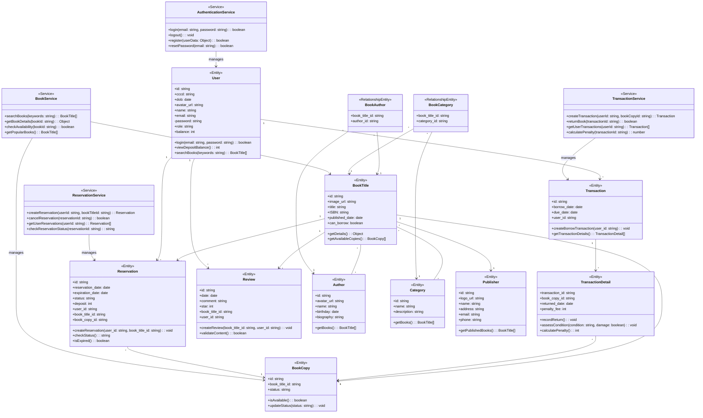

# Class Diagram for Library Management System

This class diagram represents the structure of the Library Management System. The diagram shows the relationships between various entities in the system, along with their properties and operations.

## Database Schema Class Diagram

## Controller and View Classes

```mermaid
classDiagram
    class UserController {
        <<Controller>>
        +login(credentials: Object): boolean
        +register(userData: Object): boolean
        +updateProfile(userData: Object): boolean
        +viewHistory(): Transaction[]
    }

    class BookController {
        <<Controller>>
        +searchBooks(query: Object): BookTitle[]
        +viewBookDetails(bookId: string): Object
        +rateBook(bookId: string, rating: Object): boolean
        +reserveBook(bookId: string): boolean
    }

    class LibrarianController {
        <<Controller>>
        +processBookLoan(userId: string, bookId: string): Transaction
        +processBookReturn(transactionId: string): boolean
        +manageReservations(action: string, reservationId: string): boolean
        +manageUserAccounts(action: string, userId: string): boolean
    }

    class AdminController {
        <<Controller>>
        +manageBooks(action: string, bookData: Object): boolean
        +manageAuthors(action: string, authorData: Object): boolean
        +manageCategories(action: string, categoryData: Object): boolean
        +generateReports(reportType: string): Object
    }

    class DashboardView {
        <<View>>
        +displayUserInfo(user: User): void
        +displayCurrentLoans(transactions: Transaction[]): void
        +displayReservations(reservations: Reservation[]): void
        +displayNotifications(notifications: Object[]): void
    }

    class CatalogView {
        <<View>>
        +displaySearchResults(books: BookTitle[]): void
        +displayBookDetails(book: Object): void
        +displayReviews(reviews: Review[]): void
        +renderReservationForm(bookId: string): void
    }

    UserController --> AuthenticationService : uses
    BookController --> BookService : uses
    LibrarianController --> TransactionService : uses
    LibrarianController --> ReservationService : uses
    AdminController --> BookService : uses
```

## Mapping to Use Cases

The class diagram above maps to the various use cases described in the activity and sequence diagrams:

### Authentication and User Management

-   User authentication (Sequence Diagram #1) uses User and AuthenticationService classes
-   User registration uses User and AuthenticationService classes
-   Profile management uses User and UserController classes

### Book Management

-   Book search (Sequence Diagram #2) uses BookTitle, BookService, and CatalogView
-   Book details view (Sequence Diagram #3) uses BookTitle, Author, Category, Publisher, and CatalogView
-   Book rating (Sequence Diagram #4) uses User, BookTitle, Review, and BookController
-   Book reservation (Sequence Diagram #5) uses User, BookTitle, BookCopy, Reservation, and ReservationService

### Borrowing Workflows

-   View reserved books (Sequence Diagram #6) uses User, Reservation, and DashboardView
-   Borrow reserved book (Sequence Diagram #7) uses Reservation, Transaction, and LibrarianController
-   Book borrowing (Sequence Diagram #8) uses User, BookCopy, Transaction, and LibrarianController
-   Book return (Sequence Diagram #9) uses Transaction, TransactionDetail, and LibrarianController
-   Book condition assessment (Sequence Diagram #10) uses TransactionDetail and LibrarianController

### Administrative Functions

-   Manage books (Sequence Diagram #18) uses BookTitle, BookCopy, and AdminController
-   Manage authors (Sequence Diagram #19) uses Author and AdminController
-   Manage categories (Sequence Diagram #20) uses Category and AdminController
-   Manage users (Sequence Diagram #21) uses User and AdminController
-   View statistics (Sequence Diagram #23) uses various entities and AdminController

This class diagram captures the entire database schema and necessary components for implementing the Library Management System, providing a comprehensive view of the application architecture.
