# Sequence Diagrams for Library Management System

This document contains sequence diagrams for key interactions in the Library Management System. These diagrams show the flow of interactions between different actors and components of the system.

## Table of Contents

1. [User Authentication](#1-user-authentication)
2. [Book Search Process](#2-book-search-process)
3. [Book Details View](#3-book-details-view)
4. [Book Rating Process](#4-book-rating-process)
5. [Book Reservation Process](#5-book-reservation-process)
6. [View Reserved Books](#6-view-reserved-books)
7. [Borrow Reserved Book](#7-borrow-reserved-book)
8. [Book Borrowing Process](#8-book-borrowing-process)
9. [Book Return Process](#9-book-return-process)
10. [Book Condition Assessment](#10-book-condition-assessment)
11. [Check Return Status](#11-check-return-status)
12. [View Deposit Balance](#12-view-deposit-balance)
13. [Deposit Management](#13-deposit-management)
14. [Send Question](#14-send-question)
15. [Respond to Question](#15-respond-to-question)
16. [Delete Question](#16-delete-question)
17. [Delete Rating](#17-delete-rating)
18. [Manage Books](#18-manage-books)
19. [Manage Authors](#19-manage-authors)
20. [Manage Categories](#20-manage-categories)
21. [Manage Users](#21-manage-users)
22. [Manage Librarians](#22-manage-librarians)
23. [View Statistics](#23-view-statistics)
24. [Credential Issuance by the Issuer](#24-credential-issuance-by-the-issuer)
25. [Selective Disclosure and Presentation Creation by the Holder](#25-selective-disclosure-and-presentation-creation-by-the-holder)
26. [Verification of Presentations by the Verifier](#26-verification-of-presentations-by-the-verifier)

## 1. User Authentication

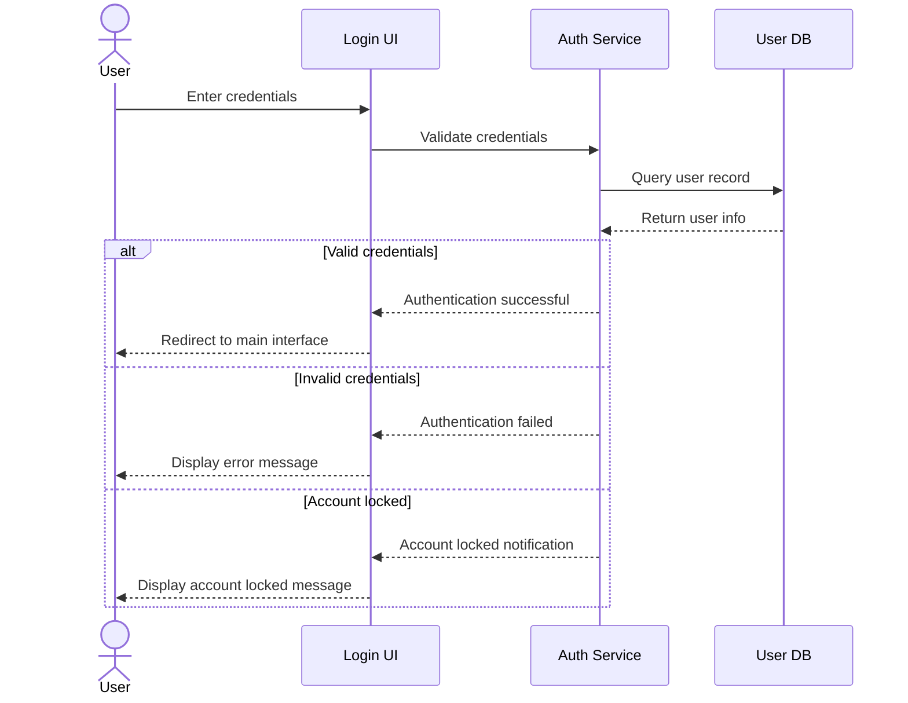
```mermaid
sequenceDiagram
    actor User
    participant Login UI
    participant Auth Service
    participant User DB

    User->>Login UI: Enter credentials
    Login UI->>Auth Service: Validate credentials
    Auth Service->>User DB: Query user record
    User DB-->>Auth Service: Return user info

    alt Valid credentials
        Auth Service-->>Login UI: Authentication successful
        Login UI-->>User: Redirect to main interface
    else Invalid credentials
        Auth Service-->>Login UI: Authentication failed
        Login UI-->>User: Display error message
    else Account locked
        Auth Service-->>Login UI: Account locked notification
        Login UI-->>User: Display account locked message
    end
```

## 2. Book Search Process

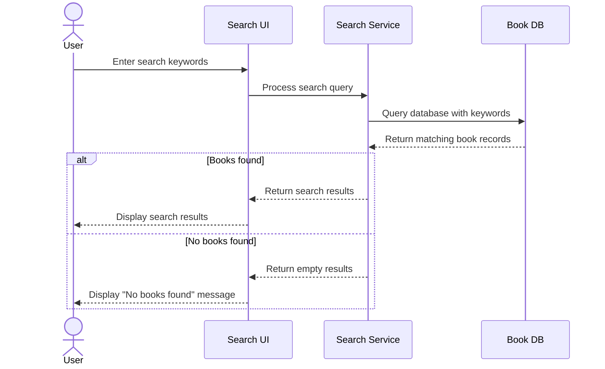
```mermaid
sequenceDiagram
    actor User
    participant Search UI
    participant Search Service
    participant Book DB

    User->>Search UI: Enter search keywords
    Search UI->>Search Service: Process search query
    Search Service->>Book DB: Query database with keywords
    Book DB-->>Search Service: Return matching book records

    alt Books found
        Search Service-->>Search UI: Return search results
        Search UI-->>User: Display search results
    else No books found
        Search Service-->>Search UI: Return empty results
        Search UI-->>User: Display "No books found" message
    end
```

## 3. Book Details View

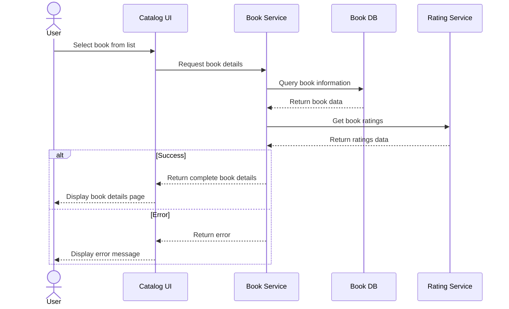
```mermaid
sequenceDiagram
    actor User
    participant Catalog UI
    participant Book Service
    participant Book DB
    participant Rating Service

    User->>Catalog UI: Select book from list
    Catalog UI->>Book Service: Request book details
    Book Service->>Book DB: Query book information
    Book DB-->>Book Service: Return book data
    Book Service->>Rating Service: Get book ratings
    Rating Service-->>Book Service: Return ratings data

    alt Success
        Book Service-->>Catalog UI: Return complete book details
        Catalog UI-->>User: Display book details page
    else Error
        Book Service-->>Catalog UI: Return error
        Catalog UI-->>User: Display error message
    end
```

## 4. Book Rating Process

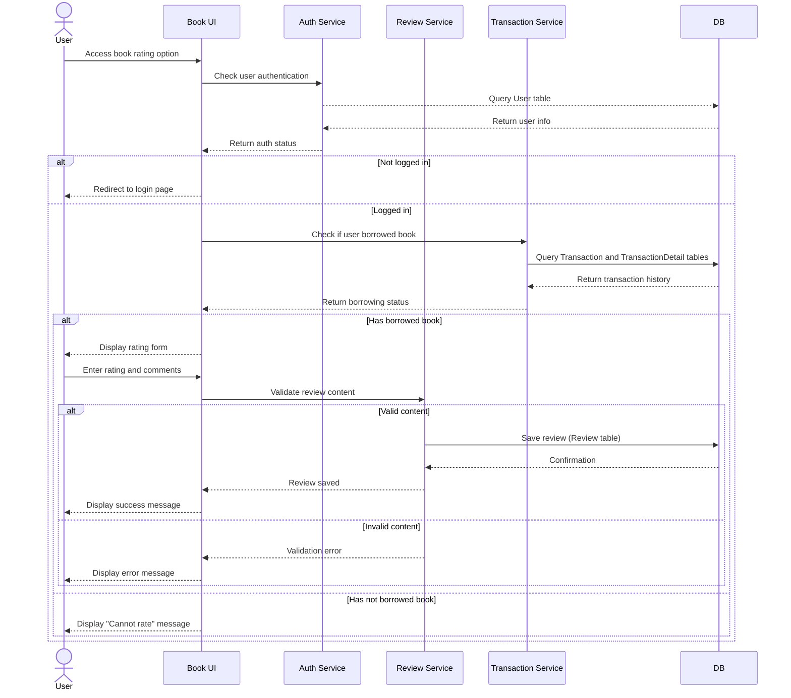
```mermaid
sequenceDiagram
    actor User
    participant Book UI
    participant Auth Service
    participant Review Service
    participant Transaction Service
    participant DB

    User->>Book UI: Access book rating option

    Book UI->>Auth Service: Check user authentication
    Auth Service-->>DB: Query User table
    DB-->>Auth Service: Return user info
    Auth Service-->>Book UI: Return auth status

    alt Not logged in
        Book UI-->>User: Redirect to login page
    else Logged in
        Book UI->>Transaction Service: Check if user borrowed book
        Transaction Service->>DB: Query Transaction and TransactionDetail tables
        DB-->>Transaction Service: Return transaction history
        Transaction Service-->>Book UI: Return borrowing status

        alt Has borrowed book
            Book UI-->>User: Display rating form
            User->>Book UI: Enter rating and comments
            Book UI->>Review Service: Validate review content

            alt Valid content
                Review Service->>DB: Save review (Review table)
                DB-->>Review Service: Confirmation
                Review Service-->>Book UI: Review saved
                Book UI-->>User: Display success message
            else Invalid content
                Review Service-->>Book UI: Validation error
                Book UI-->>User: Display error message
            end
        else Has not borrowed book
            Book UI-->>User: Display "Cannot rate" message
        end
    end
```

## 5. Book Reservation Process

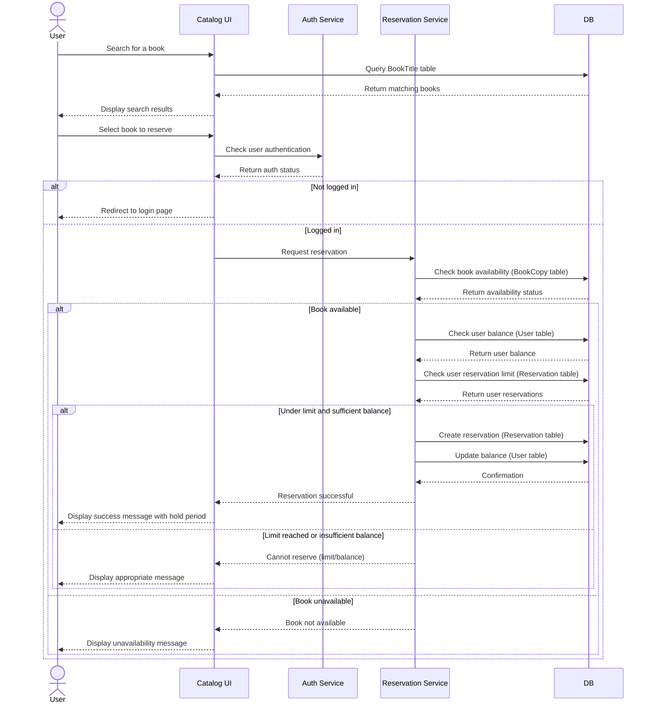
```mermaid
sequenceDiagram
    actor User
    participant Catalog UI
    participant Auth Service
    participant Reservation Service
    participant DB

    User->>Catalog UI: Search for a book
    Catalog UI->>DB: Query BookTitle table
    DB-->>Catalog UI: Return matching books
    Catalog UI-->>User: Display search results

    User->>Catalog UI: Select book to reserve
    Catalog UI->>Auth Service: Check user authentication
    Auth Service-->>Catalog UI: Return auth status

    alt Not logged in
        Catalog UI-->>User: Redirect to login page
    else Logged in
        Catalog UI->>Reservation Service: Request reservation

        Reservation Service->>DB: Check book availability (BookCopy table)
        DB-->>Reservation Service: Return availability status

        alt Book available
            Reservation Service->>DB: Check user balance (User table)
            DB-->>Reservation Service: Return user balance
            Reservation Service->>DB: Check user reservation limit (Reservation table)
            DB-->>Reservation Service: Return user reservations

            alt Under limit and sufficient balance
                Reservation Service->>DB: Create reservation (Reservation table)
                Reservation Service->>DB: Update balance (User table)
                DB-->>Reservation Service: Confirmation
                Reservation Service-->>Catalog UI: Reservation successful
                Catalog UI-->>User: Display success message with hold period
            else Limit reached or insufficient balance
                Reservation Service-->>Catalog UI: Cannot reserve (limit/balance)
                Catalog UI-->>User: Display appropriate message
            end
        else Book unavailable
            Reservation Service-->>Catalog UI: Book not available
            Catalog UI-->>User: Display unavailability message
        end
    end
```

## 6. View Reserved Books

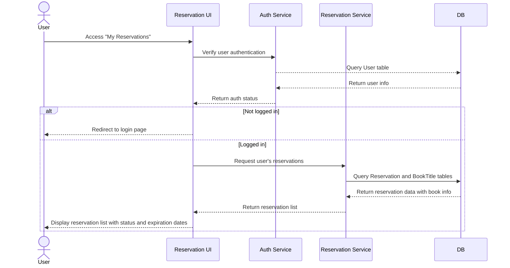
```mermaid
sequenceDiagram
    actor User
    participant Reservation UI
    participant Auth Service
    participant Reservation Service
    participant DB

    User->>Reservation UI: Access "My Reservations"
    Reservation UI->>Auth Service: Verify user authentication
    Auth Service-->>DB: Query User table
    DB-->>Auth Service: Return user info
    Auth Service-->>Reservation UI: Return auth status

    alt Not logged in
        Reservation UI-->>User: Redirect to login page
    else Logged in
        Reservation UI->>Reservation Service: Request user's reservations
        Reservation Service->>DB: Query Reservation and BookTitle tables
        DB-->>Reservation Service: Return reservation data with book info
        Reservation Service-->>Reservation UI: Return reservation list
        Reservation UI-->>User: Display reservation list with status and expiration dates
    end
```

## 7. Borrow Reserved Book

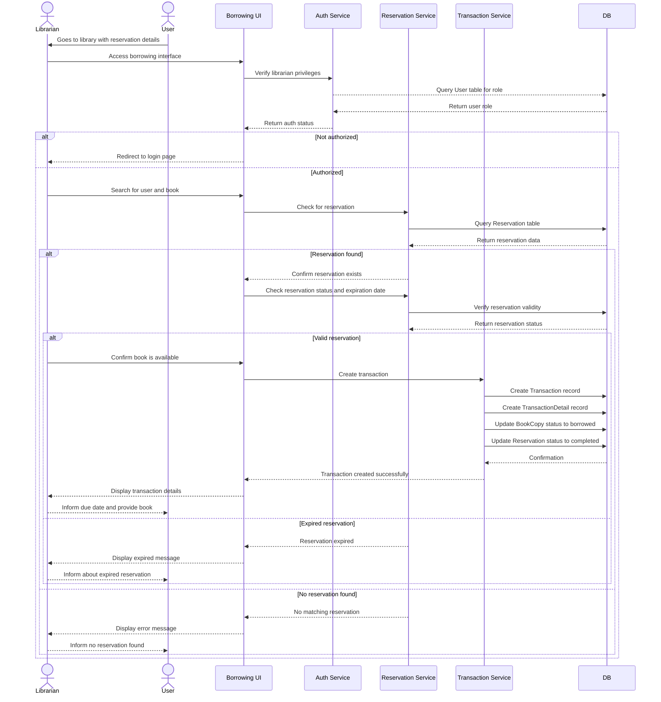
```mermaid
sequenceDiagram
    actor Librarian
    actor User
    participant Borrowing UI
    participant Auth Service
    participant Reservation Service
    participant Transaction Service
    participant DB

    User->>Librarian: Goes to library with reservation details
    Librarian->>Borrowing UI: Access borrowing interface
    Borrowing UI->>Auth Service: Verify librarian privileges
    Auth Service-->>DB: Query User table for role
    DB-->>Auth Service: Return user role
    Auth Service-->>Borrowing UI: Return auth status

    alt Not authorized
        Borrowing UI-->>Librarian: Redirect to login page
    else Authorized
        Librarian->>Borrowing UI: Search for user and book
        Borrowing UI->>Reservation Service: Check for reservation
        Reservation Service->>DB: Query Reservation table
        DB-->>Reservation Service: Return reservation data

        alt Reservation found
            Reservation Service-->>Borrowing UI: Confirm reservation exists
            Borrowing UI->>Reservation Service: Check reservation status and expiration date
            Reservation Service->>DB: Verify reservation validity
            DB-->>Reservation Service: Return reservation status

            alt Valid reservation
                Librarian->>Borrowing UI: Confirm book is available
                Borrowing UI->>Transaction Service: Create transaction
                Transaction Service->>DB: Create Transaction record
                Transaction Service->>DB: Create TransactionDetail record
                Transaction Service->>DB: Update BookCopy status to borrowed
                Transaction Service->>DB: Update Reservation status to completed
                DB-->>Transaction Service: Confirmation
                Transaction Service-->>Borrowing UI: Transaction created successfully
                Borrowing UI-->>Librarian: Display transaction details
                Librarian-->>User: Inform due date and provide book
            else Expired reservation
                Reservation Service-->>Borrowing UI: Reservation expired
                Borrowing UI-->>Librarian: Display expired message
                Librarian-->>User: Inform about expired reservation
            end
        else No reservation found
            Reservation Service-->>Borrowing UI: No matching reservation
            Borrowing UI-->>Librarian: Display error message
            Librarian-->>User: Inform no reservation found
        end
    end
```

## 8. Book Borrowing Process

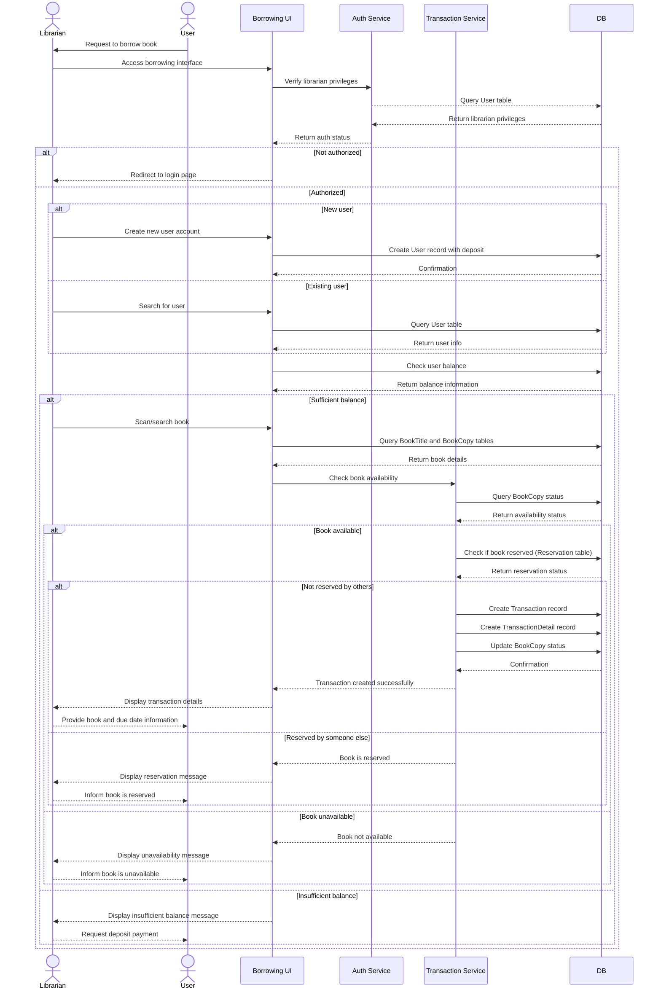
```mermaid
sequenceDiagram
    actor Librarian
    actor User
    participant Borrowing UI
    participant Auth Service
    participant Transaction Service
    participant DB

    User->>Librarian: Request to borrow book
    Librarian->>Borrowing UI: Access borrowing interface
    Borrowing UI->>Auth Service: Verify librarian privileges
    Auth Service-->>DB: Query User table
    DB-->>Auth Service: Return librarian privileges
    Auth Service-->>Borrowing UI: Return auth status

    alt Not authorized
        Borrowing UI-->>Librarian: Redirect to login page
    else Authorized
        alt New user
            Librarian->>Borrowing UI: Create new user account
            Borrowing UI->>DB: Create User record with deposit
            DB-->>Borrowing UI: Confirmation
        else Existing user
            Librarian->>Borrowing UI: Search for user
            Borrowing UI->>DB: Query User table
            DB-->>Borrowing UI: Return user info
        end

        Borrowing UI->>DB: Check user balance
        DB-->>Borrowing UI: Return balance information

        alt Sufficient balance
            Librarian->>Borrowing UI: Scan/search book
            Borrowing UI->>DB: Query BookTitle and BookCopy tables
            DB-->>Borrowing UI: Return book details
            Borrowing UI->>Transaction Service: Check book availability
            Transaction Service->>DB: Query BookCopy status
            DB-->>Transaction Service: Return availability status

            alt Book available
                Transaction Service->>DB: Check if book reserved (Reservation table)
                DB-->>Transaction Service: Return reservation status

                alt Not reserved by others
                    Transaction Service->>DB: Create Transaction record
                    Transaction Service->>DB: Create TransactionDetail record
                    Transaction Service->>DB: Update BookCopy status
                    DB-->>Transaction Service: Confirmation
                    Transaction Service-->>Borrowing UI: Transaction created successfully
                    Borrowing UI-->>Librarian: Display transaction details
                    Librarian-->>User: Provide book and due date information
                else Reserved by someone else
                    Transaction Service-->>Borrowing UI: Book is reserved
                    Borrowing UI-->>Librarian: Display reservation message
                    Librarian-->>User: Inform book is reserved
                end
            else Book unavailable
                Transaction Service-->>Borrowing UI: Book not available
                Borrowing UI-->>Librarian: Display unavailability message
                Librarian-->>User: Inform book is unavailable
            end
        else Insufficient balance
            Borrowing UI-->>Librarian: Display insufficient balance message
            Librarian-->>User: Request deposit payment
        end
    end
```

## 9. Book Return Process

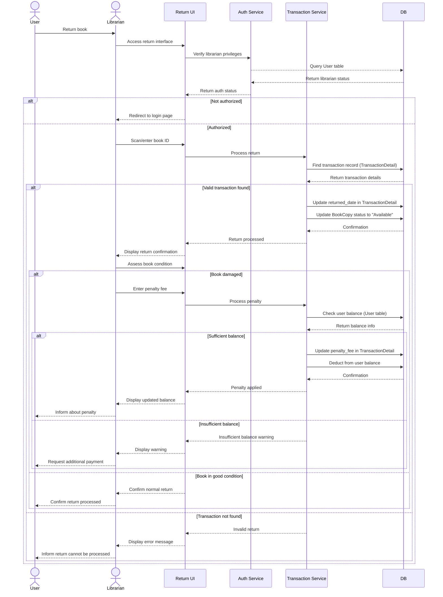
```mermaid
sequenceDiagram
    actor User
    actor Librarian
    participant Return UI
    participant Auth Service
    participant Transaction Service
    participant DB

    User->>Librarian: Return book
    Librarian->>Return UI: Access return interface
    Return UI->>Auth Service: Verify librarian privileges
    Auth Service-->>DB: Query User table
    DB-->>Auth Service: Return librarian status
    Auth Service-->>Return UI: Return auth status

    alt Not authorized
        Return UI-->>Librarian: Redirect to login page
    else Authorized
        Librarian->>Return UI: Scan/enter book ID
        Return UI->>Transaction Service: Process return
        Transaction Service->>DB: Find transaction record (TransactionDetail)
        DB-->>Transaction Service: Return transaction details

        alt Valid transaction found
            Transaction Service->>DB: Update returned_date in TransactionDetail
            Transaction Service->>DB: Update BookCopy status to "Available"
            DB-->>Transaction Service: Confirmation
            Transaction Service-->>Return UI: Return processed
            Return UI-->>Librarian: Display return confirmation

            Librarian->>Return UI: Assess book condition

            alt Book damaged
                Librarian->>Return UI: Enter penalty fee
                Return UI->>Transaction Service: Process penalty
                Transaction Service->>DB: Check user balance (User table)
                DB-->>Transaction Service: Return balance info

                alt Sufficient balance
                    Transaction Service->>DB: Update penalty_fee in TransactionDetail
                    Transaction Service->>DB: Deduct from user balance
                    DB-->>Transaction Service: Confirmation
                    Transaction Service-->>Return UI: Penalty applied
                    Return UI-->>Librarian: Display updated balance
                    Librarian-->>User: Inform about penalty
                else Insufficient balance
                    Transaction Service-->>Return UI: Insufficient balance warning
                    Return UI-->>Librarian: Display warning
                    Librarian-->>User: Request additional payment
                end
            else Book in good condition
                Return UI-->>Librarian: Confirm normal return
                Librarian-->>User: Confirm return processed
            end
        else Transaction not found
            Transaction Service-->>Return UI: Invalid return
            Return UI-->>Librarian: Display error message
            Librarian-->>User: Inform return cannot be processed
        end
    end
```

## 10. Book Condition Assessment

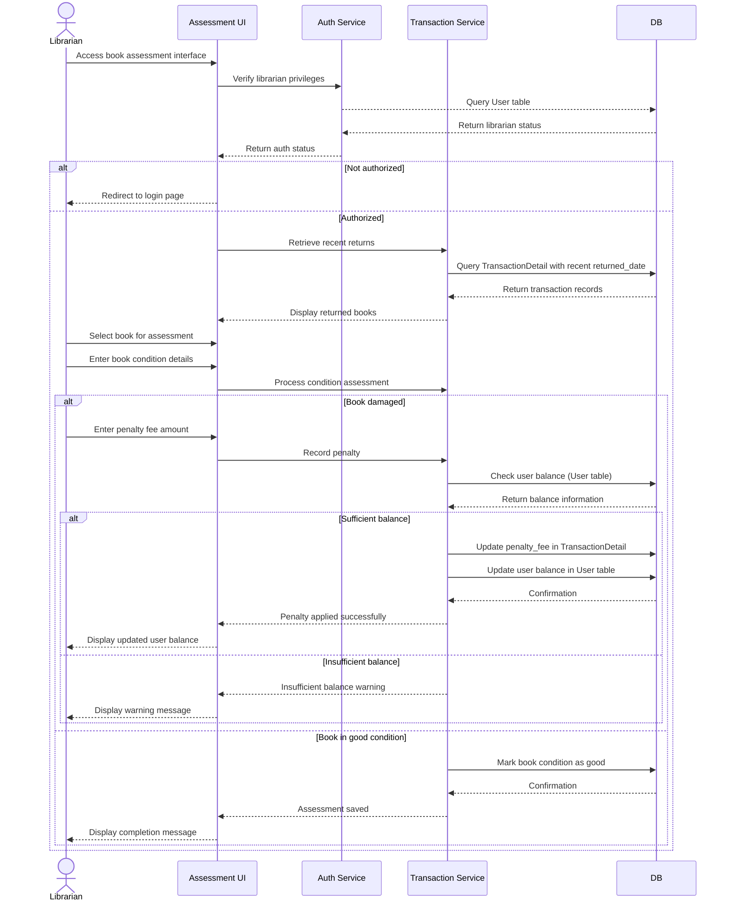
```mermaid
sequenceDiagram
    actor Librarian
    participant Assessment UI
    participant Auth Service
    participant Transaction Service
    participant DB

    Librarian->>Assessment UI: Access book assessment interface
    Assessment UI->>Auth Service: Verify librarian privileges
    Auth Service-->>DB: Query User table
    DB-->>Auth Service: Return librarian status
    Auth Service-->>Assessment UI: Return auth status

    alt Not authorized
        Assessment UI-->>Librarian: Redirect to login page
    else Authorized
        Assessment UI->>Transaction Service: Retrieve recent returns
        Transaction Service->>DB: Query TransactionDetail with recent returned_date
        DB-->>Transaction Service: Return transaction records
        Transaction Service-->>Assessment UI: Display returned books

        Librarian->>Assessment UI: Select book for assessment
        Librarian->>Assessment UI: Enter book condition details
        Assessment UI->>Transaction Service: Process condition assessment

        alt Book damaged
            Librarian->>Assessment UI: Enter penalty fee amount
            Assessment UI->>Transaction Service: Record penalty
            Transaction Service->>DB: Check user balance (User table)
            DB-->>Transaction Service: Return balance information

            alt Sufficient balance
                Transaction Service->>DB: Update penalty_fee in TransactionDetail
                Transaction Service->>DB: Update user balance in User table
                DB-->>Transaction Service: Confirmation
                Transaction Service-->>Assessment UI: Penalty applied successfully
                Assessment UI-->>Librarian: Display updated user balance
            else Insufficient balance
                Transaction Service-->>Assessment UI: Insufficient balance warning
                Assessment UI-->>Librarian: Display warning message
            end
        else Book in good condition
            Transaction Service->>DB: Mark book condition as good
            DB-->>Transaction Service: Confirmation
            Transaction Service-->>Assessment UI: Assessment saved
            Assessment UI-->>Librarian: Display completion message
        end
    end
```

## 11. Check Return Status

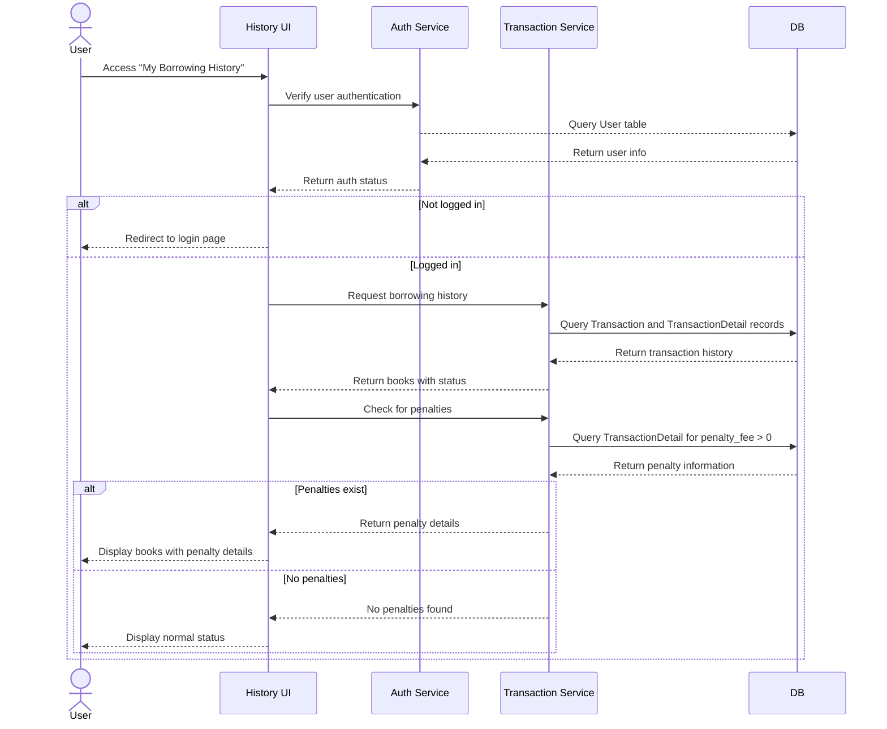
```mermaid
sequenceDiagram
    actor User
    participant History UI
    participant Auth Service
    participant Transaction Service
    participant DB

    User->>History UI: Access "My Borrowing History"
    History UI->>Auth Service: Verify user authentication
    Auth Service-->>DB: Query User table
    DB-->>Auth Service: Return user info
    Auth Service-->>History UI: Return auth status

    alt Not logged in
        History UI-->>User: Redirect to login page
    else Logged in
        History UI->>Transaction Service: Request borrowing history
        Transaction Service->>DB: Query Transaction and TransactionDetail records
        DB-->>Transaction Service: Return transaction history
        Transaction Service-->>History UI: Return books with status

        History UI->>Transaction Service: Check for penalties
        Transaction Service->>DB: Query TransactionDetail for penalty_fee > 0
        DB-->>Transaction Service: Return penalty information

        alt Penalties exist
            Transaction Service-->>History UI: Return penalty details
            History UI-->>User: Display books with penalty details
        else No penalties
            Transaction Service-->>History UI: No penalties found
            History UI-->>User: Display normal status
        end
    end
```

## 12. View Deposit Balance

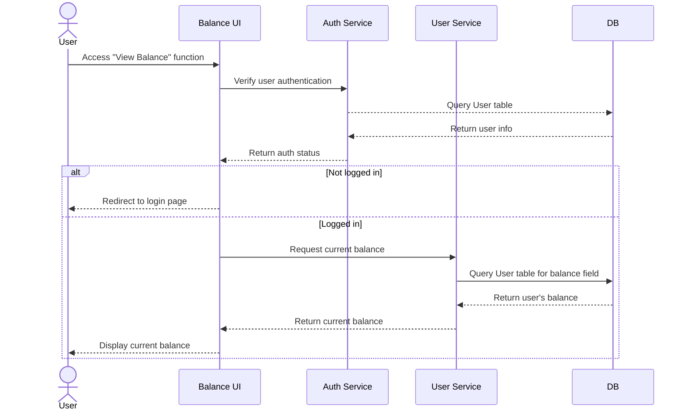
```mermaid
sequenceDiagram
    actor User
    participant Balance UI
    participant Auth Service
    participant User Service
    participant DB

    User->>Balance UI: Access "View Balance" function
    Balance UI->>Auth Service: Verify user authentication
    Auth Service-->>DB: Query User table
    DB-->>Auth Service: Return user info
    Auth Service-->>Balance UI: Return auth status

    alt Not logged in
        Balance UI-->>User: Redirect to login page
    else Logged in
        Balance UI->>User Service: Request current balance
        User Service->>DB: Query User table for balance field
        DB-->>User Service: Return user's balance
        User Service-->>Balance UI: Return current balance
        Balance UI-->>User: Display current balance
    end
```

## 13. Deposit Management

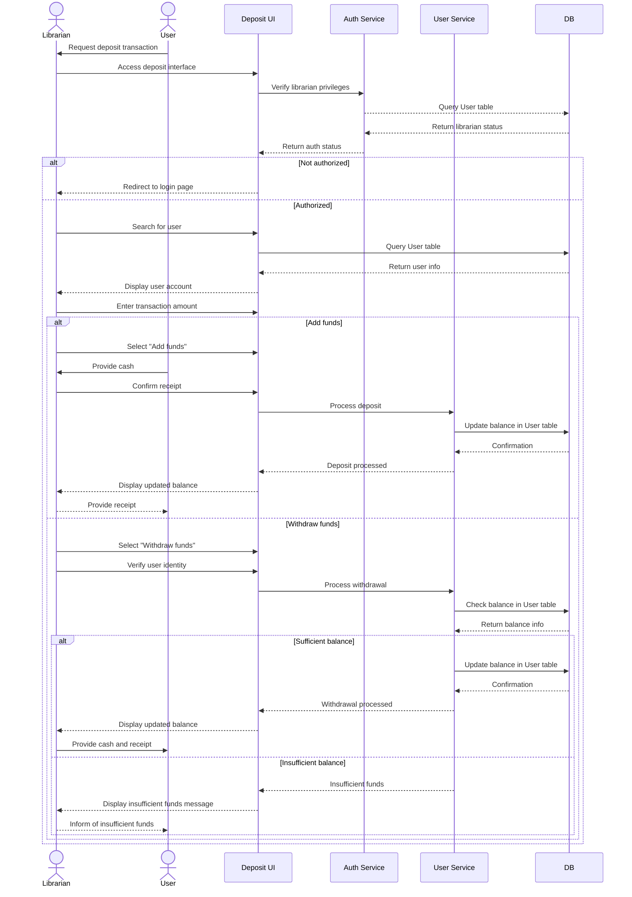
```mermaid
sequenceDiagram
    actor Librarian
    actor User
    participant Deposit UI
    participant Auth Service
    participant User Service
    participant DB

    User->>Librarian: Request deposit transaction
    Librarian->>Deposit UI: Access deposit interface
    Deposit UI->>Auth Service: Verify librarian privileges
    Auth Service-->>DB: Query User table
    DB-->>Auth Service: Return librarian status
    Auth Service-->>Deposit UI: Return auth status

    alt Not authorized
        Deposit UI-->>Librarian: Redirect to login page
    else Authorized
        Librarian->>Deposit UI: Search for user
        Deposit UI->>DB: Query User table
        DB-->>Deposit UI: Return user info
        Deposit UI-->>Librarian: Display user account

        Librarian->>Deposit UI: Enter transaction amount

        alt Add funds
            Librarian->>Deposit UI: Select "Add funds"
            User->>Librarian: Provide cash
            Librarian->>Deposit UI: Confirm receipt
            Deposit UI->>User Service: Process deposit
            User Service->>DB: Update balance in User table
            DB-->>User Service: Confirmation
            User Service-->>Deposit UI: Deposit processed
            Deposit UI-->>Librarian: Display updated balance
            Librarian-->>User: Provide receipt
        else Withdraw funds
            Librarian->>Deposit UI: Select "Withdraw funds"
            Librarian->>Deposit UI: Verify user identity
            Deposit UI->>User Service: Process withdrawal
            User Service->>DB: Check balance in User table
            DB-->>User Service: Return balance info

            alt Sufficient balance
                User Service->>DB: Update balance in User table
                DB-->>User Service: Confirmation
                User Service-->>Deposit UI: Withdrawal processed
                Deposit UI-->>Librarian: Display updated balance
                Librarian->>User: Provide cash and receipt
            else Insufficient balance
                User Service-->>Deposit UI: Insufficient funds
                Deposit UI-->>Librarian: Display insufficient funds message
                Librarian-->>User: Inform of insufficient funds
            end
        end
    end
```

## 14. Send Question

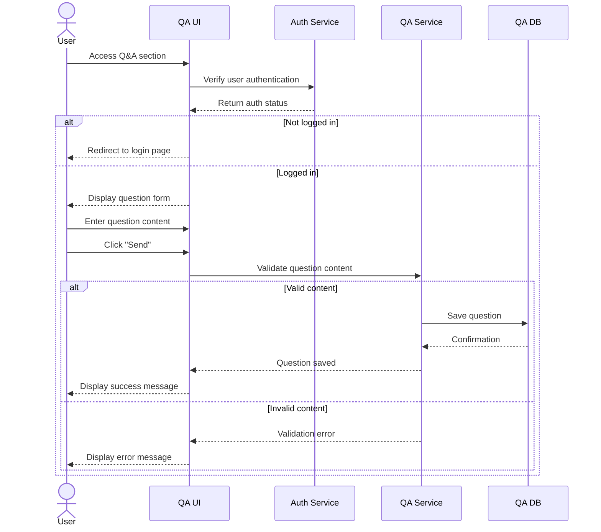
```mermaid
sequenceDiagram
    actor User
    participant QA UI
    participant Auth Service
    participant QA Service
    participant QA DB

    User->>QA UI: Access Q&A section
    QA UI->>Auth Service: Verify user authentication
    Auth Service-->>QA UI: Return auth status

    alt Not logged in
        QA UI-->>User: Redirect to login page
    else Logged in
        QA UI-->>User: Display question form
        User->>QA UI: Enter question content
        User->>QA UI: Click "Send"
        QA UI->>QA Service: Validate question content

        alt Valid content
            QA Service->>QA DB: Save question
            QA DB-->>QA Service: Confirmation
            QA Service-->>QA UI: Question saved
            QA UI-->>User: Display success message
        else Invalid content
            QA Service-->>QA UI: Validation error
            QA UI-->>User: Display error message
        end
    end
```

## 15. Respond to Question

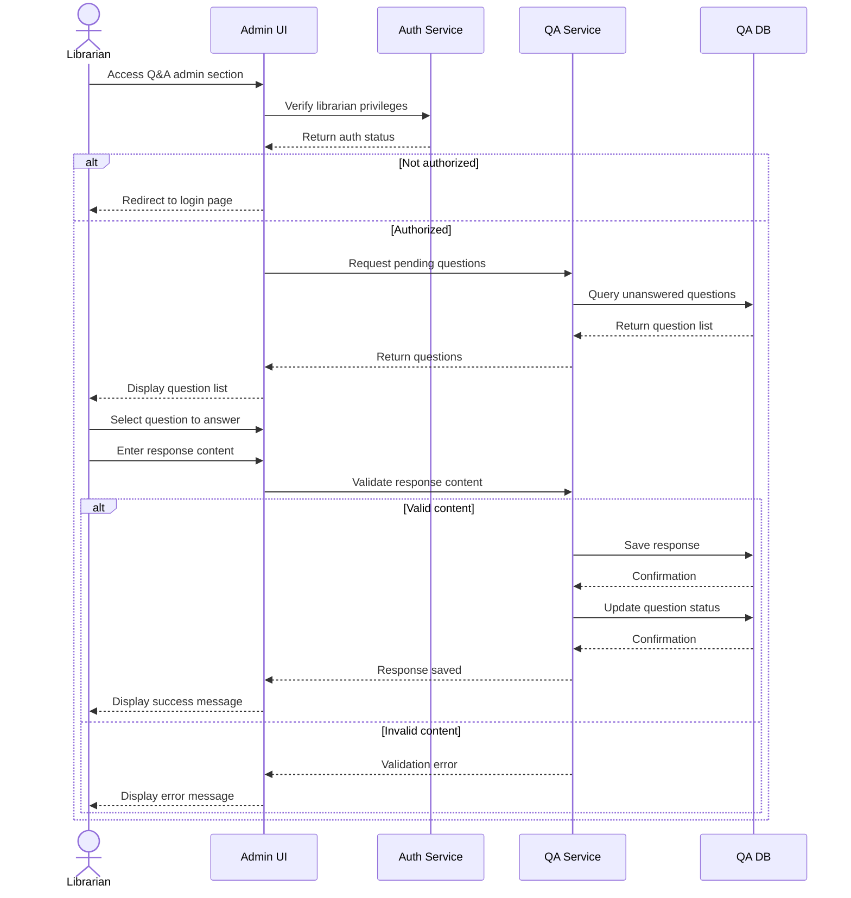
```mermaid
sequenceDiagram
    actor Librarian
    participant Admin UI
    participant Auth Service
    participant QA Service
    participant QA DB

    Librarian->>Admin UI: Access Q&A admin section
    Admin UI->>Auth Service: Verify librarian privileges
    Auth Service-->>Admin UI: Return auth status

    alt Not authorized
        Admin UI-->>Librarian: Redirect to login page
    else Authorized
        Admin UI->>QA Service: Request pending questions
        QA Service->>QA DB: Query unanswered questions
        QA DB-->>QA Service: Return question list
        QA Service-->>Admin UI: Return questions
        Admin UI-->>Librarian: Display question list

        Librarian->>Admin UI: Select question to answer
        Librarian->>Admin UI: Enter response content
        Admin UI->>QA Service: Validate response content

        alt Valid content
            QA Service->>QA DB: Save response
            QA DB-->>QA Service: Confirmation
            QA Service->>QA DB: Update question status
            QA DB-->>QA Service: Confirmation
            QA Service-->>Admin UI: Response saved
            Admin UI-->>Librarian: Display success message
        else Invalid content
            QA Service-->>Admin UI: Validation error
            Admin UI-->>Librarian: Display error message
        end
    end
```

## 16. Delete Question

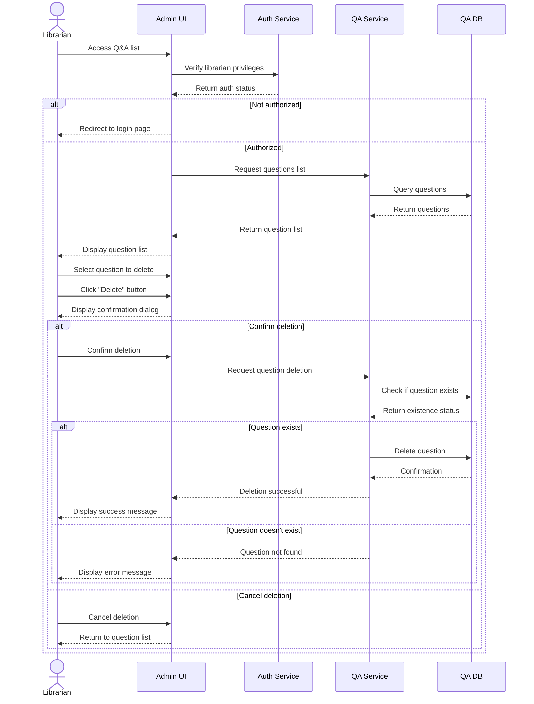
```mermaid
sequenceDiagram
    actor Librarian
    participant Admin UI
    participant Auth Service
    participant QA Service
    participant QA DB

    Librarian->>Admin UI: Access Q&A list
    Admin UI->>Auth Service: Verify librarian privileges
    Auth Service-->>Admin UI: Return auth status

    alt Not authorized
        Admin UI-->>Librarian: Redirect to login page
    else Authorized
        Admin UI->>QA Service: Request questions list
        QA Service->>QA DB: Query questions
        QA DB-->>QA Service: Return questions
        QA Service-->>Admin UI: Return question list
        Admin UI-->>Librarian: Display question list

        Librarian->>Admin UI: Select question to delete
        Librarian->>Admin UI: Click "Delete" button
        Admin UI-->>Librarian: Display confirmation dialog

        alt Confirm deletion
            Librarian->>Admin UI: Confirm deletion
            Admin UI->>QA Service: Request question deletion
            QA Service->>QA DB: Check if question exists
            QA DB-->>QA Service: Return existence status

            alt Question exists
                QA Service->>QA DB: Delete question
                QA DB-->>QA Service: Confirmation
                QA Service-->>Admin UI: Deletion successful
                Admin UI-->>Librarian: Display success message
            else Question doesn't exist
                QA Service-->>Admin UI: Question not found
                Admin UI-->>Librarian: Display error message
            end
        else Cancel deletion
            Librarian->>Admin UI: Cancel deletion
            Admin UI-->>Librarian: Return to question list
        end
    end
```

## 17. Delete Rating

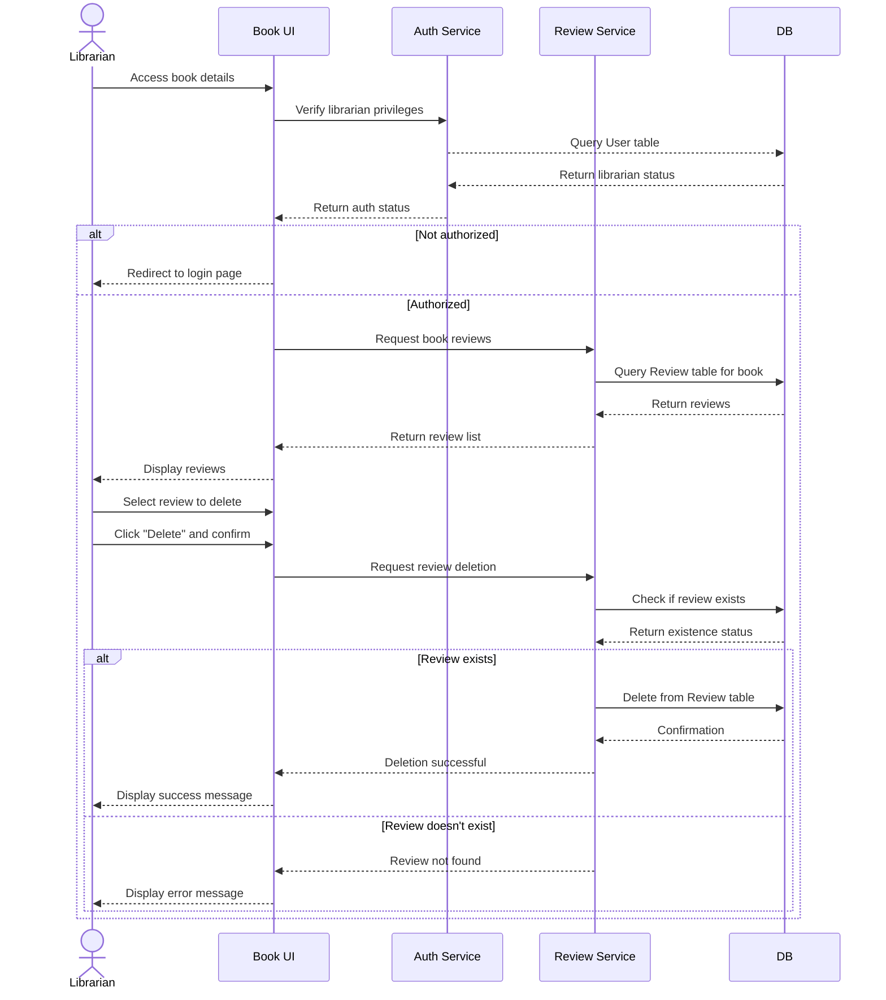
```mermaid
sequenceDiagram
    actor Librarian
    participant Book UI
    participant Auth Service
    participant Review Service
    participant DB

    Librarian->>Book UI: Access book details
    Book UI->>Auth Service: Verify librarian privileges
    Auth Service-->>DB: Query User table
    DB-->>Auth Service: Return librarian status
    Auth Service-->>Book UI: Return auth status

    alt Not authorized
        Book UI-->>Librarian: Redirect to login page
    else Authorized
        Book UI->>Review Service: Request book reviews
        Review Service->>DB: Query Review table for book
        DB-->>Review Service: Return reviews
        Review Service-->>Book UI: Return review list
        Book UI-->>Librarian: Display reviews

        Librarian->>Book UI: Select review to delete
        Librarian->>Book UI: Click "Delete" and confirm
        Book UI->>Review Service: Request review deletion
        Review Service->>DB: Check if review exists
        DB-->>Review Service: Return existence status

        alt Review exists
            Review Service->>DB: Delete from Review table
            DB-->>Review Service: Confirmation
            Review Service-->>Book UI: Deletion successful
            Book UI-->>Librarian: Display success message
        else Review doesn't exist
            Review Service-->>Book UI: Review not found
            Book UI-->>Librarian: Display error message
        end
    end
```

## 18. Manage Books

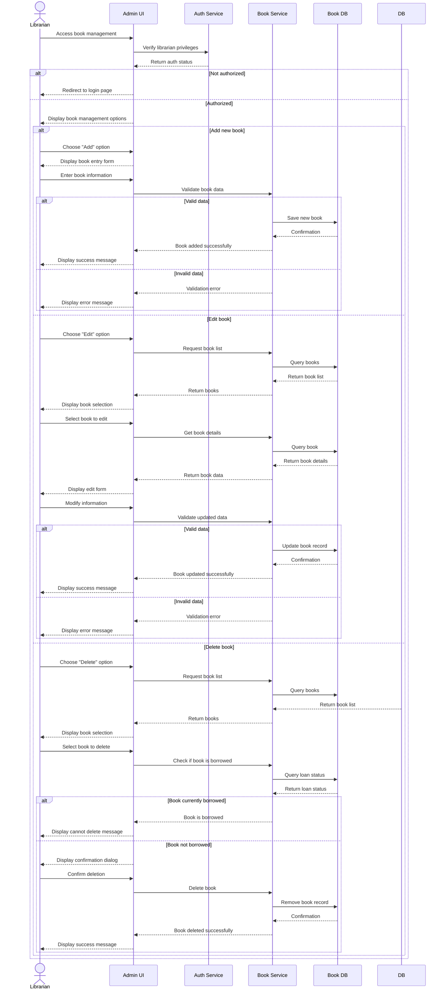
```mermaid
sequenceDiagram
    actor Librarian
    participant Admin UI
    participant Auth Service
    participant Book Service
    participant Book DB

    Librarian->>Admin UI: Access book management
    Admin UI->>Auth Service: Verify librarian privileges
    Auth Service-->>Admin UI: Return auth status

    alt Not authorized
        Admin UI-->>Librarian: Redirect to login page
    else Authorized
        Admin UI-->>Librarian: Display book management options

        alt Add new book
            Librarian->>Admin UI: Choose "Add" option
            Admin UI-->>Librarian: Display book entry form
            Librarian->>Admin UI: Enter book information
            Admin UI->>Book Service: Validate book data

            alt Valid data
                Book Service->>Book DB: Save new book
                Book DB-->>Book Service: Confirmation
                Book Service-->>Admin UI: Book added successfully
                Admin UI-->>Librarian: Display success message
            else Invalid data
                Book Service-->>Admin UI: Validation error
                Admin UI-->>Librarian: Display error message
            end

        else Edit book
            Librarian->>Admin UI: Choose "Edit" option
            Admin UI->>Book Service: Request book list
            Book Service->>Book DB: Query books
            Book DB-->>Book Service: Return book list
            Book Service-->>Admin UI: Return books
            Admin UI-->>Librarian: Display book selection

            Librarian->>Admin UI: Select book to edit
            Admin UI->>Book Service: Get book details
            Book Service->>Book DB: Query book
            Book DB-->>Book Service: Return book details
            Book Service-->>Admin UI: Return book data
            Admin UI-->>Librarian: Display edit form

            Librarian->>Admin UI: Modify information
            Admin UI->>Book Service: Validate updated data

            alt Valid data
                Book Service->>Book DB: Update book record
                Book DB-->>Book Service: Confirmation
                Book Service-->>Admin UI: Book updated successfully
                Admin UI-->>Librarian: Display success message
            else Invalid data
                Book Service-->>Admin UI: Validation error
                Admin UI-->>Librarian: Display error message
            end

        else Delete book
            Librarian->>Admin UI: Choose "Delete" option
            Admin UI->>Book Service: Request book list
            Book Service->>Book DB: Query books
            DB-->>Book Service: Return book list
            Book Service-->>Admin UI: Return books
            Admin UI-->>Librarian: Display book selection

            Librarian->>Admin UI: Select book to delete
            Admin UI->>Book Service: Check if book is borrowed
            Book Service->>Book DB: Query loan status
            Book DB-->>Book Service: Return loan status

            alt Book currently borrowed
                Book Service-->>Admin UI: Book is borrowed
                Admin UI-->>Librarian: Display cannot delete message
            else Book not borrowed
                Admin UI-->>Librarian: Display confirmation dialog
                Librarian->>Admin UI: Confirm deletion
                Admin UI->>Book Service: Delete book
                Book Service->>Book DB: Remove book record
                Book DB-->>Book Service: Confirmation
                Book Service-->>Admin UI: Book deleted successfully
                Admin UI-->>Librarian: Display success message
            end
        end
    end
```

## 19. Manage Authors

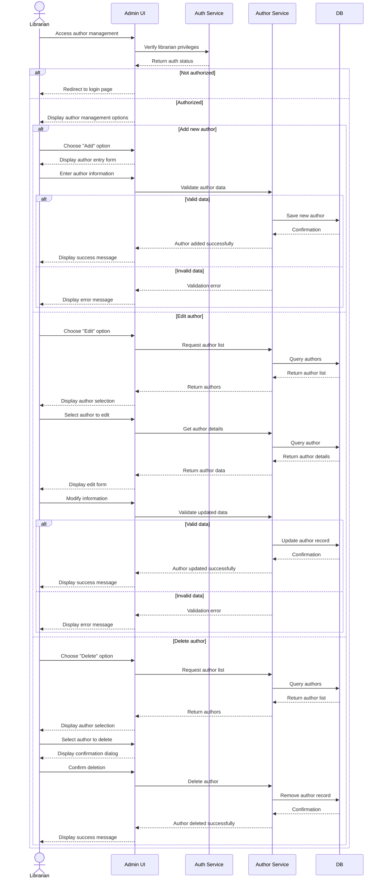
```mermaid
sequenceDiagram
    actor Librarian
    participant Admin UI
    participant Auth Service
    participant Author Service
    participant DB

    Librarian->>Admin UI: Access author management
    Admin UI->>Auth Service: Verify librarian privileges
    Auth Service-->>Admin UI: Return auth status

    alt Not authorized
        Admin UI-->>Librarian: Redirect to login page
    else Authorized
        Admin UI-->>Librarian: Display author management options

        alt Add new author
            Librarian->>Admin UI: Choose "Add" option
            Admin UI-->>Librarian: Display author entry form
            Librarian->>Admin UI: Enter author information
            Admin UI->>Author Service: Validate author data

            alt Valid data
                Author Service->>DB: Save new author
                DB-->>Author Service: Confirmation
                Author Service-->>Admin UI: Author added successfully
                Admin UI-->>Librarian: Display success message
            else Invalid data
                Author Service-->>Admin UI: Validation error
                Admin UI-->>Librarian: Display error message
            end

        else Edit author
            Librarian->>Admin UI: Choose "Edit" option
            Admin UI->>Author Service: Request author list
            Author Service->>DB: Query authors
            DB-->>Author Service: Return author list
            Author Service-->>Admin UI: Return authors
            Admin UI-->>Librarian: Display author selection

            Librarian->>Admin UI: Select author to edit
            Admin UI->>Author Service: Get author details
            Author Service->>DB: Query author
            DB-->>Author Service: Return author details
            Author Service-->>Admin UI: Return author data
            Admin UI-->>Librarian: Display edit form

            Librarian->>Admin UI: Modify information
            Admin UI->>Author Service: Validate updated data

            alt Valid data
                Author Service->>DB: Update author record
                DB-->>Author Service: Confirmation
                Author Service-->>Admin UI: Author updated successfully
                Admin UI-->>Librarian: Display success message
            else Invalid data
                Author Service-->>Admin UI: Validation error
                Admin UI-->>Librarian: Display error message
            end

        else Delete author
            Librarian->>Admin UI: Choose "Delete" option
            Admin UI->>Author Service: Request author list
            Author Service->>DB: Query authors
            DB-->>Author Service: Return author list
            Author Service-->>Admin UI: Return authors
            Admin UI-->>Librarian: Display author selection

            Librarian->>Admin UI: Select author to delete
            Admin UI-->>Librarian: Display confirmation dialog
            Librarian->>Admin UI: Confirm deletion
            Admin UI->>Author Service: Delete author
            Author Service->>DB: Remove author record
            DB-->>Author Service: Confirmation
            Author Service-->>Admin UI: Author deleted successfully
            Admin UI-->>Librarian: Display success message
        end
    end
```

## 20. Manage Categories

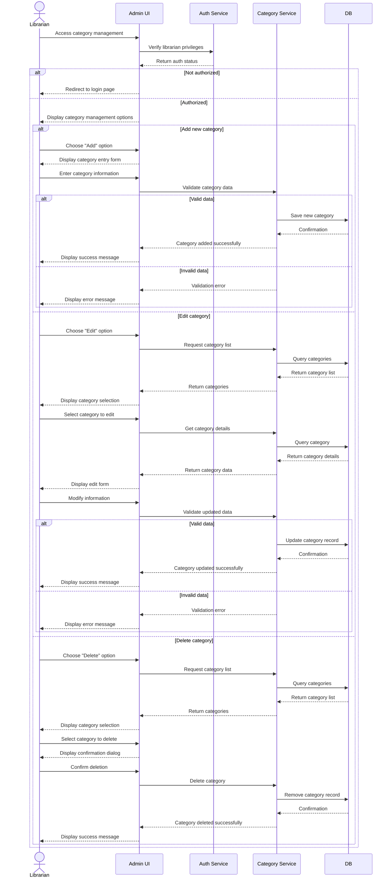
```mermaid
sequenceDiagram
    actor Librarian
    participant Admin UI
    participant Auth Service
    participant Category Service
    participant DB

    Librarian->>Admin UI: Access category management
    Admin UI->>Auth Service: Verify librarian privileges
    Auth Service-->>Admin UI: Return auth status

    alt Not authorized
        Admin UI-->>Librarian: Redirect to login page
    else Authorized
        Admin UI-->>Librarian: Display category management options

        alt Add new category
            Librarian->>Admin UI: Choose "Add" option
            Admin UI-->>Librarian: Display category entry form
            Librarian->>Admin UI: Enter category information
            Admin UI->>Category Service: Validate category data

            alt Valid data
                Category Service->>DB: Save new category
                DB-->>Category Service: Confirmation
                Category Service-->>Admin UI: Category added successfully
                Admin UI-->>Librarian: Display success message
            else Invalid data
                Category Service-->>Admin UI: Validation error
                Admin UI-->>Librarian: Display error message
            end

        else Edit category
            Librarian->>Admin UI: Choose "Edit" option
            Admin UI->>Category Service: Request category list
            Category Service->>DB: Query categories
            DB-->>Category Service: Return category list
            Category Service-->>Admin UI: Return categories
            Admin UI-->>Librarian: Display category selection

            Librarian->>Admin UI: Select category to edit
            Admin UI->>Category Service: Get category details
            Category Service->>DB: Query category
            DB-->>Category Service: Return category details
            Category Service-->>Admin UI: Return category data
            Admin UI-->>Librarian: Display edit form

            Librarian->>Admin UI: Modify information
            Admin UI->>Category Service: Validate updated data

            alt Valid data
                Category Service->>DB: Update category record
                DB-->>Category Service: Confirmation
                Category Service-->>Admin UI: Category updated successfully
                Admin UI-->>Librarian: Display success message
            else Invalid data
                Category Service-->>Admin UI: Validation error
                Admin UI-->>Librarian: Display error message
            end

        else Delete category
            Librarian->>Admin UI: Choose "Delete" option
            Admin UI->>Category Service: Request category list
            Category Service->>DB: Query categories
            DB-->>Category Service: Return category list
            Category Service-->>Admin UI: Return categories
            Admin UI-->>Librarian: Display category selection

            Librarian->>Admin UI: Select category to delete
            Admin UI-->>Librarian: Display confirmation dialog
            Librarian->>Admin UI: Confirm deletion
            Admin UI->>Category Service: Delete category
            Category Service->>DB: Remove category record
            DB-->>Category Service: Confirmation
            Category Service-->>Admin UI: Category deleted successfully
            Admin UI-->>Librarian: Display success message
        end
    end
```

## 21. Manage Users

```mermaid
sequenceDiagram
    actor Admin
    participant Admin UI
    participant Auth Service
    participant User Service
    participant User DB

    Admin->>Admin UI: Access user management
    Admin UI->>Auth Service: Verify admin privileges
    Auth Service-->>Admin UI: Return auth status

    alt Not authorized
        Admin UI-->>Admin: Redirect to login page
    else Authorized
        Admin UI-->>Admin: Display user management options

        alt Add new user
            Admin->>Admin UI: Choose "Add" option
            Admin UI-->>Admin: Display user entry form
            Admin->>Admin UI: Enter user information
            Admin->>Admin UI: Record initial deposit
            Admin UI->>User Service: Validate user data

            alt Valid data
                User Service->>User DB: Create user account
                User Service->>User DB: Set initial deposit
                User DB-->>User Service: Confirmation
                User Service-->>Admin UI: User added successfully
                Admin UI-->>Admin: Display success message
            else Invalid data
                User Service-->>Admin UI: Validation error
                Admin UI-->>Admin: Display error message
            end

        else Edit user
            Admin->>Admin UI: Choose "Edit" option
            Admin UI->>User Service: Request user list
            User Service->>User DB: Query users
            User DB-->>User Service: Return user list
            User Service-->>Admin UI: Return users
            Admin UI-->>Admin: Display user selection

            Admin->>Admin UI: Select user to edit
            Admin UI->>User Service: Get user details
            User Service->>User DB: Query user
            User DB-->>User Service: Return user details
            User Service-->>Admin UI: Return user data
            Admin UI-->>Admin: Display edit form

            Admin->>Admin UI: Modify information
            Admin UI->>User Service: Validate updated data

            alt Valid data
                User Service->>User DB: Update user record
                User DB-->>User Service: Confirmation
                User Service-->>Admin UI: User updated successfully
                Admin UI-->>Admin: Display success message
            else Invalid data
                User Service-->>Admin UI: Validation error
                Admin UI-->>Admin: Display error message
            end

        else Disable user
            Admin->>Admin UI: Choose "Disable" option
            Admin UI->>User Service: Request user list
            User Service->>User DB: Query active users
            User DB-->>User Service: Return active user list
            User Service-->>Admin UI: Return users
            Admin UI-->>Admin: Display user selection

            Admin->>Admin UI: Select user to disable
            Admin UI-->>Admin: Display confirmation dialog
            Admin->>Admin UI: Confirm disabling
            Admin UI->>User Service: Change user status
            User Service->>User DB: Update user status
            User DB-->>User Service: Confirmation
            User Service-->>Admin UI: User disabled successfully
            Admin UI-->>Admin: Display success message
        end
    end
```

## 22. Manage Librarians

```mermaid
sequenceDiagram
    actor Admin
    participant Admin UI
    participant Auth Service
    participant User Service
    participant User DB

    Admin->>Admin UI: Access user list
    Admin UI->>Auth Service: Verify admin privileges
    Auth Service-->>Admin UI: Return auth status

    alt Not authorized
        Admin UI-->>Admin: Redirect to login page
    else Authorized
        Admin UI->>User Service: Request user list
        User Service->>User DB: Query users
        User DB-->>User Service: Return user list
        User Service-->>Admin UI: Return users
        Admin UI-->>Admin: Display user list

        Admin->>Admin UI: Select user to change permissions
        Admin UI-->>Admin: Display permission options

        alt Grant librarian role
            Admin->>Admin UI: Choose "Grant Librarian Role"
            Admin UI->>User Service: Check current user role
            User Service->>User DB: Query user permissions
            User DB-->>User Service: Return user permissions

            alt Already a librarian
                User Service-->>Admin UI: User already has role
                Admin UI-->>Admin: Display error message
            else Not a librarian
                Admin UI->>User Service: Update user permissions
                User Service->>User DB: Add librarian role
                User DB-->>User Service: Confirmation
                User Service-->>Admin UI: Role updated successfully
                Admin UI-->>Admin: Display success message
            end

        else Revoke librarian role
            Admin->>Admin UI: Choose "Revoke Librarian Role"
            Admin UI->>User Service: Check current user role
            User Service->>User DB: Query user permissions
            User DB-->>User Service: Return user permissions

            alt Is a librarian
                Admin UI->>User Service: Update user permissions
                User Service->>User DB: Remove librarian role
                User DB-->>User Service: Confirmation
                User Service-->>Admin UI: Role updated successfully
                Admin UI-->>Admin: Display success message
            else Not a librarian
                User Service-->>Admin UI: User doesn't have role
                Admin UI-->>Admin: Display error message
            end
        end
    end
```

## 23. View Statistics

```mermaid
sequenceDiagram
    actor Staff
    participant Stats UI
    participant Auth Service
    participant Stats Service
    participant DB

    Staff->>Stats UI: Access statistics
    Stats UI->>Auth Service: Verify staff privileges
    Auth Service-->>Stats UI: Return auth status

    alt Not authorized
        Stats UI-->>Staff: Redirect to login page
    else Authorized
        Stats UI-->>Staff: Display statistics options

        alt Book statistics
            Staff->>Stats UI: Select "Books" statistics
            Stats UI->>Stats Service: Request book stats
            Stats Service->>DB: Query book data
            DB-->>Stats Service: Return book data

            alt Data available
                Stats Service-->>Stats UI: Return processed statistics
                Stats UI-->>Staff: Display book statistics

                opt Export data
                    Staff->>Stats UI: Request export
                    Stats UI->>Stats Service: Generate report
                    Stats Service-->>Stats UI: Return report file
                    Stats UI-->>Staff: Download report
                end
            else No data
                Stats Service-->>Stats UI: No data available
                Stats UI-->>Staff: Display no data message
            end

        else Category statistics
            Staff->>Stats UI: Select "Categories" statistics
            Stats UI->>Stats Service: Request category stats
            Stats Service->>DB: Query category data
            DB-->>Stats Service: Return category data

            alt Data available
                Stats Service-->>Stats UI: Return processed statistics
                Stats UI-->>Staff: Display category statistics

                opt Export data
                    Staff->>Stats UI: Request export
                    Stats UI->>Stats Service: Generate report
                    Stats Service-->>Stats UI: Return report file
                    Stats UI-->>Staff: Download report
                end
            else No data
                Stats Service-->>Stats UI: No data available
                Stats UI-->>Staff: Display no data message
            end

        else Publisher statistics
            Staff->>Stats UI: Select "Publishers" statistics
            Stats UI->>Stats Service: Request publisher stats
            Stats Service->>DB: Query publisher data
            DB-->>Stats Service: Return publisher data

            alt Data available
                Stats Service-->>Stats UI: Return processed statistics
                Stats UI-->>Staff: Display publisher statistics

                opt Export data
                    Staff->>Stats UI: Request export
                    Stats UI->>Stats Service: Generate report
                    Stats Service-->>Stats UI: Return report file
                    Stats UI-->>Staff: Download report
                end
            else No data
                Stats Service-->>Stats UI: No data available
                Stats UI-->>Staff: Display no data message
            end
        end
    end
```

## 24. Credential Issuance by the Issuer

```mermaid
sequenceDiagram
    actor Issuer
    participant IdentityService
    participant CredentialService
    participant Holder

    Issuer->>IdentityService: Create Issuer Identity
    IdentityService-->>Issuer: Return Issuer DID

    Issuer->>CredentialService: Issue Credential (Signed with Issuer DID)
    CredentialService-->>Issuer: Return Signed Credential

    Issuer-->>Holder: Send Signed Credential
```

## 25. Selective Disclosure and Presentation Creation by the Holder

```mermaid
sequenceDiagram
    actor Holder
    participant Wallet
    participant Verifier

    Holder->>Wallet: Request Presentation Creation
    Wallet->>Wallet: Selectively Disclose Credential Attributes
    Wallet->>Wallet: Sign Presentation with Holder DID
    Wallet-->>Holder: Return Signed Presentation

    Holder-->>Verifier: Send Signed Presentation
```

## 26. Verification of Presentations by the Verifier

```mermaid
sequenceDiagram
    actor Verifier
    participant VerificationService
    participant Issuer

    Verifier->>VerificationService: Validate Presentation
    VerificationService->>Issuer: Verify Credential Signature
    Issuer-->>VerificationService: Confirm Credential Validity

    alt Valid Presentation
        VerificationService-->>Verifier: Verification Successful
    else Invalid Presentation
        VerificationService-->>Verifier: Verification Failed
    end
```
