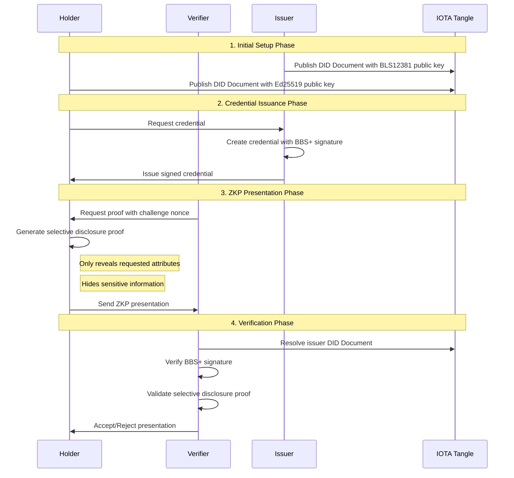

# Privacy Preserving Identity Systems and Zero-Knowledge Proofs

This document provides a comprehensive overview of privacy-preserving identity systems, explains why Self-Sovereign Identity (SSI) is the optimal foundation for Zero-Knowledge Proof implementations, and demonstrates how these technologies integrate within enterprise architectures to deliver secure, private, and scalable identity solutions.

## Table of Contents

1. [Privacy-Preserving Identity Systems (PPIDS)](#1-privacy-preserving-identity-systems-ppids)
    - [Evolution of Digital Identity](#evolution-of-digital-identity)
    - [Comparison of Identity Models](#comparison-of-identity-models)
    - [Why Traditional Systems Fail at Privacy](#why-traditional-systems-fail-at-privacy)
2. [Self-Sovereign Identity as Trust Anchor](#2-self-sovereign-identity-as-trust-anchor)
    - [The SSI Process: W3C Trust Triangle](#the-ssi-process-w3c-trust-triangle)
    - [DIDs and DID Documents](#dids-and-did-documents)
    - [Public/Private Key Relationships](#publicprivate-key-relationships)
    - [How SSI Enables ZKP](#how-ssi-enables-zkp)
3. [Zero-Knowledge Proofs in SSI](#3-zero-knowledge-proofs-in-ssi)
    - [The Problem ZKP Solves in SSI](#the-problem-zkp-solves-in-ssi)
    - [ZKP Integration Points in SSI Flow](#zkp-integration-points-in-ssi-flow)
    - [ZKP Sequence Diagram](#zkp-sequence-diagram)
4. [ZKP Implementation with IOTA Identity](#4-zkp-implementation-with-iota-identity)
    - [Step-by-Step Code Walkthrough](#step-by-step-code-walkthrough)
    - [Implementation Details](#implementation-details)
5. [Enterprise Architecture and Deployment](#5-enterprise-architecture-and-deployment)
    - [Layered Architecture View](#layered-architecture-view)
    - [Security Architecture Framework](#security-architecture-framework)
    - [Real-world Deployment Patterns](#real-world-deployment-patterns)

---

## 1. Privacy Preserving Identity Systems (PPIDS)

### Evolution of Digital Identity

Digital identity management has undergone significant evolution, driven by increasing privacy concerns, regulatory requirements, and technological advances. Understanding this evolution is crucial for appreciating why Zero-Knowledge Proofs represent a fundamental breakthrough in privacy-preserving identity verification.

The journey from centralized identity systems to privacy-preserving architectures reflects broader shifts in how we conceptualize data ownership, user privacy, and trust relationships in digital systems.

```
┌─────────────────────────────────────────────────────────────────────────────┐
│                    EVOLUTION OF DIGITAL IDENTITY                            │
├─────────────────────────────────────────────────────────────────────────────┤
│                                                                             │
│  CENTRALIZED ERA (1990s-2000s)                                              │
│  ┌────────────────────────────────────────────────────────────────────────┐ │
│  │ • Single authority controls all identity data                          │ │
│  │ • Users have no control over their information                         │ │
│  │ • High risk of data breaches and misuse                                │ │
│  │ • Privacy is an afterthought                                           │ │
│  └────────────────────────────────────────────────────────────────────────┘ │
│                                    │                                        │
│                                    ▼                                        │
│  FEDERATED ERA (2000s-2010s)                                                │
│  ┌────────────────────────────────────────────────────────────────────────┐ │
│  │ • Identity providers manage credentials for multiple services          │ │
│  │ • Reduced password fatigue but increased tracking                      │ │
│  │ • Privacy concerns with IdP surveillance                               │ │
│  │ • Still centralized trust models                                       │ │
│  └────────────────────────────────────────────────────────────────────────┘ │
│                                    │                                        │
│                                    ▼                                        │
│  SELF-SOVEREIGN ERA (2010s-Present)                                         │
│  ┌────────────────────────────────────────────────────────────────────────┐ │
│  │ • Users control their own identity data                                │ │
│  │ • Decentralized trust through cryptography                             │ │
│  │ • Privacy by design with selective disclosure                          │ │
│  │ • Zero-Knowledge Proofs enable true privacy                            │ │
│  └────────────────────────────────────────────────────────────────────────┘ │
└─────────────────────────────────────────────────────────────────────────────┘
```

### Comparison of Identity Models

Digital identity management has evolved from centralized systems through federated models to today's self-sovereign approach. Each model differs in how identity data is stored, who controls it, and how privacy is handled. The following table summarizes the key differences between centralized, federated, and self-sovereign identity systems:

| **Aspect**          | **Centralized Identity**                                                                                                                                                                                | **Federated Identity**                                                                                                                                                                                                                                                                                                | **Self-Sovereign Identity (SSI)**                                                                                                                                                                                                                                                                                                                             |
| ------------------- | ------------------------------------------------------------------------------------------------------------------------------------------------------------------------------------------------------- | --------------------------------------------------------------------------------------------------------------------------------------------------------------------------------------------------------------------------------------------------------------------------------------------------------------------- | ------------------------------------------------------------------------------------------------------------------------------------------------------------------------------------------------------------------------------------------------------------------------------------------------------------------------------------------------------------- |
| **Control of Data** | Little user control: a central authority (e.g., a government agency or a company) maintains and controls the identity data. Users must trust this single entity.                                        | Shared control: identity providers (IdPs) like Google or Facebook manage user credentials, but users can access multiple services via the IdP. The IdP mediates trust between user and service providers.                                                                                                             | User-centric control: the user fully controls their identity data in personal wallets. No single authority can alter or revoke identity without user consent.                                                                                                                                                                                                 |
| **Data Storage**    | Stored in a centralized database or directory. Identity information is kept in one silo, creating a single point of failure.                                                                            | Stored by the identity provider and sometimes relayed to various service providers. Data may be replicated across multiple services (e.g., each service gets some of the user's data from the IdP).                                                                                                                   | Stored by the user (typically locally) as portable credentials. Public decentralized ledgers store only identifiers or public keys, not personal data.                                                                                                                                                                                                        |
| **Privacy**         | Low privacy: users often must disclose a lot of personal data to the central entity and each service. The central database can see and log all usage. Data can be repurposed beyond the user's control. | Moderate privacy: reduces repeated credential entries, but the IdP sees when and where a user logs in. Users often consent to broad data sharing with the IdP. Tracking across services by the IdP is possible. Personal data may still be shared widely with each service during login (e.g., your profile details). | High privacy: minimal disclosure by design. Users share only specific attributes as needed (e.g., proof of age, not full birthdate). Exchanges are often cryptographically blinded, so even the verifying parties learn only what is strictly necessary. No central log of all transactions exists.                                                           |
| **Security & Risk** | Central point of attack: a breach of the central repository can leak millions of identities. Users are vulnerable if the central authority is compromised or negligent.                                 | Federated risk: if the federated IdP is breached, it can expose access to many linked accounts. Also, if user credentials at IdP are stolen, multiple services are at risk. However, federated systems can reduce password reuse (improving security in that sense).                                                  | Decentralized security: no single point of failure. Compromise of one credential or one issuer does not expose all user data. Breaches are confined since data is not aggregated in one place. The use of encryption and ZKPs further protects against data leakage.                                                                                          |
| **Dependency**      | Fully dependent on the central provider. If that provider goes offline or shuts down, the identity may become unusable elsewhere. Users have no alternative way to prove identity.                      | High dependency on the identity provider. If the IdP service is down (or an account is blocked), the user might be locked out of multiple services. Users also must trust the IdP's policies.                                                                                                                         | No single dependency on a provider. Multiple issuers can provide credentials (e.g., government for ID, bank for financial attestations, university for diploma). Even if one issuer is unreachable, other credentials remain valid. Verification can often happen offline by checking digital signatures, without needing a live database query to an issuer. |
| **Examples**        | Company employee directories; a social network requiring its own account to access its services; government ID databases used strictly within government systems.                                       | Federated login systems like Facebook Connect or Google Sign-In (one login gives access to third-party sites); Corporate single sign-on in enterprises (e.g., using SAML or OAuth with an IdP like Okta).                                                                                                             | Decentralized identity frameworks like Sovrin/Hyperledger Indy network for credentials, Ethereum + DID solutions (e.g., uPort/Polygon ID), or Microsoft ION (DID network on Bitcoin). These allow credentials portable across domains.                                                                                                                        |

**Table 1: Comparison of Centralized, Federated, and Self-Sovereign Identity Models**

In SSI, the individual holds the "source of truth" of their identity (in the form of verifiable credentials) rather than relying on a provider to vouch for them each time. This model addresses many pain points of earlier systems. For instance, centralized identity can lead to "honeypot" data breaches, and federated identity, while more user-friendly, raises privacy issues with identity providers tracking user logins and sharing data beyond the user's control. By contrast, SSI's decentralized approach can eliminate central points of failure and minimize data trails, enhancing both security and privacy.

### Why Traditional Systems Fail at Privacy

One practical difference is seen in the authentication process. In a federated login (say, "Sign in with Google"), Google authenticates the user and then shares an assertion of the user's identity to the third-party application – but Google learns where the user is logging in and can potentially share or monetize that knowledge. In an SSI scenario, the user could instead present a verifiable credential (issued, for example, by a trusted KYC provider or government) directly to the application. Google (or any intermediary) is not involved, so no extra party learns of this transaction. The application can locally verify the credential's signature (optionally checking a decentralized registry for issuer public keys or credential revocation status), and the user's privacy is preserved.

This "trust triangle" of issuer-holder-verifier in SSI effectively replaces the one-to-many hub of federated IdP systems with a distributed model where trust is anchored in cryptography and often blockchain rather than in a single organization.

The fundamental privacy failures of traditional systems stem from their architectural assumptions:

```
┌─────────────────────────────────────────────────────────────────────────────┐
│                    PRIVACY FAILURES IN TRADITIONAL SYSTEMS                  │
├─────────────────────────────────────────────────────────────────────────────┤
│                                                                             │
│  CENTRALIZED SYSTEMS                                                        │
│  ┌────────────────────────────────────────────────────────────────────────┐ │
│  │                          PRIVACY PROBLEMS                              │ │
│  │                                                                        │ │
│  │ • All-or-Nothing Disclosure: Users must share complete profiles        │ │
│  │ • Data Aggregation: Central systems build comprehensive user profiles  │ │
│  │ • Surveillance by Design: Every transaction is logged and monitored    │ │
│  │ • Vendor Lock-in: Users cannot move their identity to other systems    │ │
│  │ • Honeypot Effect: Centralized databases become attractive targets     │ │
│  └────────────────────────────────────────────────────────────────────────┘ │
│                                                                             │
│  FEDERATED SYSTEMS                                                          │
│  ┌────────────────────────────────────────────────────────────────────────┐ │
│  │                          PRIVACY PROBLEMS                              │ │
│  │                                                                        │ │
│  │ • IdP Surveillance: Identity providers track all user activities       │ │
│  │ • Data Brokering: IdPs monetize user data through tracking             │ │
│  │ • Consent Fatigue: Users approve broad data sharing without review     │ │
│  │ • Correlation Attacks: IdPs can correlate user behavior across sites   │ │
│  │ • Single Point of Surveillance: One entity sees all user interactions  │ │
│  └────────────────────────────────────────────────────────────────────────┘ │
└─────────────────────────────────────────────────────────────────────────────┘
```

## 2. Self-Sovereign Identity as Trust Anchor

### The SSI Process: W3C Trust Triangle

Self-Sovereign Identity (SSI) is a model for digital identity management that gives individuals control over their identity information without relying on centralized authorities. The SSI ecosystem consists of three primary actors working within the W3C Trust Triangle:

```
┌───────────────────┐
│      ISSUER       │
│                   │
│ - Creates and     │
│   signs VCs       │
│ - Publishes DID   │
│   Document        │
└─────────┬─────────┘
          │
     1. Issues
   Credential with
      signature
          │
          ▼
┌───────────────────┐         ┌───────────────────┐
│      HOLDER       │         │     VERIFIER      │
│                   │    2.   │                   │
│ - Stores VCs      │ Present │ - Validates       │
│ - Controls        │Selective│  presentations    │
│   disclosure      │  Data   │ - Checks issuer   │
│ - Creates         │ ──────> │   signatures      │
│   presentations   │         │ - Trusts issuer   │
└───────────────────┘         └─────────┬─────────┘
          ▲                             │
          │                             │
          └─────────────────────────────┘
                3. Trust Relationship
                   (Optional direct)
```

The trust triangle demonstrates how:

1. **Issuer → Holder**: The issuer creates a credential containing claims about the holder and cryptographically signs it.
2. **Holder → Verifier**: The holder presents selective information from their credentials to the verifier.
3. **Verifier → Issuer**: The verifier trusts the issuer's attestations by validating their signature.

### DIDs and DID Documents

Decentralized Identifiers (DIDs) are a fundamental component of SSI. They are:

-   **Globally unique identifiers** that don't require a centralized registry
-   **Persistent** and don't change over time
-   **Resolvable** to DID documents containing verification methods
-   **Cryptographically verifiable** and controlled by the DID subject

A DID looks like this:

```
did:iota:0x123456789abcdef...
  ^    ^         ^
  |    |         |
Method Method-   Method-specific identifier
       specific  (unique ID string)
       identifier
       (blockchain/ledger)
```

In the IOTA Identity framework, DIDs are stored on the IOTA Tangle (distributed ledger), making them immutable and tamper-proof.

A DID Document is a JSON-LD document that contains information associated with a DID, including:

-   **Verification Methods**: Public keys used for authentication and authorization
-   **Services**: Endpoints where the DID subject can be contacted or interacted with
-   **Authentication Methods**: References to verification methods for authentication
-   **Assertion Methods**: References to verification methods for making assertions

Example DID Document structure:

```json
{
    "@context": "https://www.w3.org/ns/did/v1",
    "id": "did:iota:0x123456789abcdef...",
    "verificationMethod": [
        {
            "id": "did:iota:0x123456789abcdef...#key-1",
            "type": "Ed25519VerificationKey2018",
            "controller": "did:iota:0x123456789abcdef...",
            "publicKeyMultibase": "z28Kp7P9...DQk"
        },
        {
            "id": "did:iota:0x123456789abcdef...#key-2",
            "type": "BLS12381G2Key2020",
            "controller": "did:iota:0x123456789abcdef...",
            "publicKeyMultibase": "zUC7LTaPw...JWN"
        }
    ],
    "authentication": ["did:iota:0x123456789abcdef...#key-1"],
    "assertionMethod": ["did:iota:0x123456789abcdef...#key-2"],
    "service": [
        {
            "id": "did:iota:0x123456789abcdef...#linked-domain",
            "type": "LinkedDomains",
            "serviceEndpoint": "https://example.com"
        }
    ]
}
```

### Public/Private Key Relationships

In the SSI model, cryptographic key pairs are essential:

1. **Private Keys**:

    - Stored securely by the entity (never shared)
    - Used to sign credentials, presentations, and DID operations
    - Controlled solely by the DID subject
    - Can be rotated and revoked if compromised

2. **Public Keys**:
    - Published in the DID Document
    - Used by others to verify signatures
    - Different types for different purposes (authentication, assertion, etc.)
    - Can be associated with different verification methods

Key types in our implementation:

-   **Ed25519**: Fast, secure signing for general operations
-   **BLS12381**: Enables advanced cryptographic operations needed for ZKPs and selective disclosure

The relationship looks like:

```
┌───────────────┐              ┌───────────────┐
│  Private Key  │              │  Public Key   │
│ (stored       │  derives     │ (published in │
│  securely)    │─────────────>│  DID Document)│
└───────────────┘              └───────────────┘
        │                              │
        │                              │
        ▼                              ▼
   Signs Data                   Verifies Signature
```

### How SSI Enables ZKP

SSI provides the essential foundation for Zero-Knowledge Proofs by enabling:

-   **Holder-controlled credentials**: Users store their own credentials locally
-   **Cryptographic credential formats**: BBS+ signatures support selective disclosure
-   **Decentralized verification**: No need to contact issuers during verification
-   **Trust through cryptography**: Mathematical proofs instead of institutional trust

## 3. Zero-Knowledge Proofs in SSI

### The Problem ZKP Solves in SSI

While SSI gives users control over their identity data, traditional credential presentations still reveal too much information. Zero-Knowledge Proofs solve this fundamental privacy problem:

```
┌────────────────────────────────────────────────────────────────────────────────┐
│                    THE PRIVACY PROBLEM IN IDENTITY                             │
├────────────────────────────────────────────────────────────────────────────────┤
│                                                                                │
│  WITHOUT ZKP: ALL-OR-NOTHING DISCLOSURE                                        │
│  ┌──────────────────────────────────────────────────────────────────────────┐  │
│  │                                                                          │  │
│  │  VERIFIER: "Prove you're over 21"                                        │  │
│  │                                                                          │  │
│  │  HOLDER MUST REVEAL:                                                     │  │
│  │  ✗ Full name: "John Smith"                                              │  │
│  │  ✗ Date of birth: "1985-03-15"                                          │  │
│  │  ✗ Address: "123 Main St, Anytown"                                      │  │
│  │  ✗ License number: "DL123456789"                                        │  │
│  │  ✗ Expiration date: "2028-03-15"                                        │  │
│  │                                                                          │  │
│  │  PRIVACY VIOLATIONS:                                                     │  │
│  │  • Unnecessary personal data exposure                                    │  │
│  │  • Potential for correlation across services                             │  │
│  │  • Data minimization principles violated                                 │  │
│  └──────────────────────────────────────────────────────────────────────────┘  │
│                                    │                                           │
│                                    ▼                                           │
│  WITH ZKP: SELECTIVE DISCLOSURE                                                │
│  ┌──────────────────────────────────────────────────────────────────────────┐  │
│  │                                                                          │  │
│  │  VERIFIER: "Prove you're over 21"                                        │  │
│  │                                                                          │  │
│  │  HOLDER REVEALS ONLY:                                                    │  │
│  │  ✓ age_over_21: true                                                     │  │
│  │  ✓ credential_valid: true                                                │  │
│  │  ✓ issued_by: "trusted_dmv"                                              │  │
│  │                                                                          │  │
│  │  PRIVACY PRESERVED:                                                      │  │
│  │  • No personal identifiers disclosed                                     │  │
│  │  • Unlinkable presentations                                              │  │
│  │  • Data minimization achieved                                            │  │
│  └──────────────────────────────────────────────────────────────────────────┘  │
└────────────────────────────────────────────────────────────────────────────────┘
```

### ZKP Integration Points in SSI Flow

Zero-Knowledge Proofs integrate at specific points in the SSI credential flow. The following diagram shows the key integration points where ZKP enables privacy-preserving verification:

```
┌──────────────────────────────────────────────────────────────────────────────┐
│                    ZKP INTEGRATION IN SSI FLOW                               │
├──────────────────────────────────────────────────────────────────────────────┤
│                                                                              │
│  ┌─────────────────┐        ┌─────────────────┐       ┌─────────────────┐    │
│  │     ISSUER      │        │     HOLDER      │       │    VERIFIER     │    │
│  │  (Credential    │        │   (Individual)  │       │   (Service)     │    │
│  │   Authority)    │        │                 │       │                 │    │
│  └────────┬────────┘        └────────┬────────┘       └────────┬────────┘    │
│           │                          │                          │            │
│           │ 1. Creates               │                          │            │
│           │ credential with BBS+     │                          │            │
│           │ signature (ZKP-ready)    │                          │            │
│           │                          │                          │            │
│           │ 2. Issues credential     │                          │            │
│           │────────────────────────> │                          │            │
│           │                          │                          │            │
│           │                          │ 3. Stores credential     │            │
│           │                          │    in digital wallet     │            │
│           │                          │                          │            │
│           │                          │ <─────────────────────── │            │
│           │                          │ 4. Requests proof with   │            │
│           │                          │    challenge nonce       │            │
│           │                          │                          │            │
│           │                          │ 5. Creates ZKP with      │            │
│           │                          │    selective disclosure  │            │
│           │                          │    ZKP MAGIC HERE!       │            │
│           │                          │    (Hides sensitive      │            │
│           │                          │     attributes)          │            │
│           │                          │                          │            │
│           │                          │ 6. Sends presentation    │            │
│           │                          │    with ZKP proof        │            │
│           │                          │ ────────────────────────>│            │
│           │                          │                          │            │
│           │                          │                          │ 7. Verifies│
│           │                          │                          │    ZKP proof│
│           │                          │                          │    without  │
│           │                          │                          │    seeing   │
│           │                          │                          │    hidden   │
│           │                          │                          │    data     │
└──────────────────────────────────────────────────────────────────────────────┘
```

**Key ZKP Integration Points:**
- **Point 1**: Issuer creates BBS+ signed credentials (enables future ZKP)
- **Point 5**: Holder generates selective disclosure proof (core ZKP operation)
- **Point 7**: Verifier validates proof without accessing hidden attributes

### ZKP Sequence Diagram

The detailed sequence of ZKP operations in an SSI system:



Key ZKP operations:

-   **BBS+ Signature Creation**: Issuer signs multiple credential attributes
-   **Selective Disclosure**: Holder chooses which attributes to reveal
-   **Zero-Knowledge Proof**: Mathematical proof without revealing hidden data
-   **Signature Verification**: Verifier validates without seeing hidden attributes

## 4. ZKP Implementation with IOTA Identity

This section provides a complete code walkthrough of implementing Zero-Knowledge Proofs with IOTA Identity, demonstrating selective disclosure using BBS+ signatures within the SSI framework.

The implementation follows the ZKP integration points and sequence diagram from section 3, showing how the three SSI actors work together:

-   **Issuer**: Creates credentials with BBS+ signatures that enable ZKP
-   **Holder**: Stores credentials and generates selective disclosure proofs
-   **Verifier**: Validates ZKP presentations without seeing hidden data

### Step 1: Creating Issuer Identity

The issuer creates an identity with a verification method capable of BBS+ signatures, which enable selective disclosure.

```typescript
// Create client to connect to IOTA network
const iotaClient = new IotaClient({ url: NETWORK_URL })
const network = await iotaClient.getChainIdentifier()

// Create storage for issuer's keys
const issuerStorage = getMemstorage()

// Get funded client
const issuerClient = await getFundedClient(issuerStorage)

// Create unpublished issuer document
const unpublishedIssuerDocument = new IotaDocument(network)

// Generate verification method with BLS for BBS+ signatures
const issuerFragment = await unpublishedIssuerDocument.generateMethodJwp(
    issuerStorage,
    ProofAlgorithm.BLS12381_SHA256,
    undefined,
    MethodScope.VerificationMethod()
)

// Publish issuer identity to the network
const { output: issuerIdentity } = await issuerClient
    .createIdentity(unpublishedIssuerDocument)
    .finish()
    .buildAndExecute(issuerClient)
const issuerDocument = issuerIdentity.didDocument()
```

### Step 2: Creating and Signing Credentials

The issuer creates a credential with subject data and signs it using BBS+ signatures.

```typescript
// Create credential subject
const subject = {
    name: "Hứa Văn Lý",
    mainCourses: ["Software Engineering", "System Modeling"],
    degree: {
        type: "BachelorDegree",
        name: "Bachelor of Software Engineering",
    },
    GPA: 3.34,
}

// Build credential using the subject and issuer
const credential = new Credential({
    id: "https:/uit.edu.vn/credentials/3732",
    issuer: issuerDocument.id(),
    type: "UniversityDegreeCredential",
    credentialSubject: subject,
})

// Create JPT credential with BBS+ signature
const credentialJpt = await issuerDocument.createCredentialJpt(
    credential,
    issuerStorage,
    issuerFragment,
    new JwpCredentialOptions()
)

// Validate the credential's proof
const decodedJpt = JptCredentialValidator.validate(
    credentialJpt,
    issuerDocument,
    new JptCredentialValidationOptions(),
    FailFast.FirstError
)
```

The credential JWT (JPT) is a structured token with three parts:

-   Header: Contains algorithm info and claims metadata
-   Payload: Contains the actual credential data
-   Signature: Cryptographic proof of the credential's authenticity

### Step 3: Issuer Sends Credential to Holder

In a real system, the issuer would securely transmit the credential to the holder:

```typescript
// In a real system, this would involve secure transmission
// Here we simply pass the credential JWT string
const credentialJptString = credentialJpt.toString()
// Transmit credentialJptString to holder...
```

### Step 4: Holder Resolves Issuer's DID and Validates Credential

The holder needs to resolve the issuer's DID to obtain their public key for validation:

```typescript
// Create identity client to resolve DIDs
const identityClientReadOnly = await IdentityClientReadOnly.createWithPkgId(
    iotaClient,
    IOTA_IDENTITY_PKG_ID
)

// Extract issuer DID from credential
let issuerDid = IotaDID.parse(
    JptCredentialValidatorUtils.extractIssuerFromIssuedJpt(
        credentialJpt
    ).toString()
)

// Resolve issuer's DID to get their DID document
let issuerDoc = await identityClientReadOnly.resolveDid(issuerDid)

// Validate the credential
let decodedCredential = JptCredentialValidator.validate(
    credentialJpt,
    issuerDoc,
    new JptCredentialValidationOptions(),
    FailFast.FirstError
)
```

### Step 5: Verifier Sends Challenge for Presentation

The verifier generates a unique, random challenge that the holder must incorporate into their presentation. This prevents replay attacks:

```typescript
// Generate a random challenge
const challenge = "475a7984-1bb5-4c4c-a56f-822bccd46440"
```

### Step 6: Holder Creates Selective Disclosure Presentation

The holder decides which fields to conceal and which to reveal - this is where ZKP happens:

```typescript
// Get method ID from credential for referencing verification method
const methodId = decodedCredential.decodedJwp().getIssuerProtectedHeader().kid!

// Create selective disclosure presentation from credential
const selectiveDisclosurePresentation = new SelectiveDisclosurePresentation(
    decodedCredential.decodedJwp()
)

// Conceal specific fields - this is the core of ZKP!
selectiveDisclosurePresentation.concealInSubject("mainCourses[1]")
selectiveDisclosurePresentation.concealInSubject("degree.name")
```

### Step 7: Holder Creates Presentation JWT

The holder creates a presentation JWT with the selective disclosure and challenge:

```typescript
// Set up presentation options with the challenge
const presentationOptions = new JwpPresentationOptions()
presentationOptions.nonce = challenge

// Create presentation JWT
const presentationJpt = await issuerDoc.createPresentationJpt(
    selectiveDisclosurePresentation,
    methodId,
    presentationOptions
)
```

### Step 8: Holder Sends Presentation to Verifier

The holder sends the presentation to the verifier:

```typescript
// In a real system, this would involve secure transmission
// Here we simply pass the presentation JWT string
const presentationJptString = presentationJpt.toString()
// Transmit presentationJptString to verifier...
```

When decoded, a presentation JWT payload shows the specialized BBS+ format:

```json
{
    "payloads": [
        "ImRpZDppb3RhOmNiY2Y4ZDM1OjB4Yzc0MTAzNjIzN2JiYWZhM2VmYjcwMGJmNmJkZDQ5OTBhOGRlMzZjNWVkNDdkNTFhYTVhNzQwYmMwMDFkNGRlZiI",
        null,
        null,
        "Imh0dHBzOi8vd3d3LnczLm9yZy8yMDE4L2NyZWRlbnRpYWxzL3YxIg",
        "IlZlcmlmaWFibGVDcmVkZW50aWFsIg",
        "IlVuaXZlcnNpdHlEZWdyZWVDcmVkZW50aWFsIg",
        "My4zNA",
        "IkJhY2hlbG9yRGVncmVlIg",
        null,
        "IlNvZnR3YXJlIEVuZ2luZWVyaW5nIg",
        null,
        "IkhydeG4gVsSDbiBMw70i"
    ],
    "issuer": "eyJ0eXAiOiJKUFQiLCJhbGci...",
    "proof": "eyJhbGciOiJCQlMtQkxTMTIzOD...",
    "presentation": "eyJub25jZSI6IjQ3NWE3OTg..."
}
```

**Key Components:**

-   **payloads**: Array format where null values represent concealed attributes
-   **issuer**: Information about the issuer's DID document for public key lookup
-   **proof**: Cryptographic BBS+ signature proof validating authenticity
-   **presentation**: Challenge response data preventing replay attacks

### Why the Different Encoding Formats?

-   The original credential uses a JSON format (easier for humans to read)
-   The BBS+ algorithm requires individual attributes to be processed separately to enable selective disclosure
-   The payloads array uses a specialized encoding format required by the cryptographic library
-   The double-encoding happens because:
    1. First encoding: Each value is encoded to maintain consistent binary representation
    2. Second encoding: The encoded values are processed by the BBS+ algorithm, which outputs Base64-encoded values

This specialized format allows the cryptographic proof to work properly even when some fields are concealed.

### Step 9: Verifier Validates the Presentation

The verifier resolves the issuer's DID and validates the presentation:

```typescript
// Extract issuer DID from presentation
const issuerDidV = IotaDID.parse(
    JptPresentationValidatorUtils.extractIssuerFromPresentedJpt(
        presentationJpt
    ).toString()
)

// Resolve issuer's DID to get their DID document
const issuerDocV = await identityClientReadOnly.resolveDid(issuerDidV)

// Set up validation options with the challenge
const presentationValidationOptions = new JptPresentationValidationOptions({
    nonce: challenge,
})

// Validate the presentation
const decodedPresentedCredential = JptPresentationValidator.validate(
    presentationJpt,
    issuerDocV,
    presentationValidationOptions,
    FailFast.FirstError
)
```

After validation, the verifier sees only the disclosed fields:

```json
{
    "name": "Hứa Văn Lý",
    "mainCourses": ["Software Engineering"],
    "degree": {
        "type": "BachelorDegree"
    },
    "GPA": 3.34
}
```

The beauty of ZKP is that the verifier can cryptographically verify that:

1. The entire credential was properly signed by the issuer
2. No tampering has occurred with any fields
3. The challenge was properly incorporated (preventing replay attacks)

All this while seeing only the fields the holder chose to disclose!

---

## 5. Enterprise Architecture and Deployment

### Layered Architecture View

The layered architecture view shows how ZKP fits within the enterprise SSI system from a business perspective down to implementation:

```
┌───────────────────────────────────────────────────────────────────────────────┐
│                      ENTERPRISE LAYERED ARCHITECTURE                          │
├───────────────────────────────────────────────────────────────────────────────┤
│                                                                               │
│  ┌─────────────────────────────────────────────────────────────────────────┐  │
│  │                        BUSINESS LAYER                                   │  │
│  │  • Identity Verification Requirements                                   │  │
│  │  • Privacy Compliance (GDPR, CCPA)                                      │  │
│  │  • Trust Framework Policies                                             │  │
│  │  • Customer Experience Goals                                            │  │
│  └─────────────────────────────────────────────────────────────────────────┘  │
│                                    │                                          │
│                                    ▼                                          │
│  ┌─────────────────────────────────────────────────────────────────────────┐  │
│  │                      APPLICATION LAYER                                  │  │
│  │  • SSI Wallet Applications                                              │  │
│  │  • Verifier Portals                                                     │  │
│  │  • Issuer Management Systems                                            │  │
│  │  • DID Resolver Services                                                │  │
│  └─────────────────────────────────────────────────────────────────────────┘  │
│                                    │                                          │
│                                    ▼                                          │
│  ┌─────────────────────────────────────────────────────────────────────────┐  │
│  │                      INTEGRATION LAYER                                  │  │
│  │  • API Gateways                                                         │  │
│  │  • Service Orchestration                                                │  │
│  │  • Message Queues                                                       │  │
│  │  • Event Streaming                                                      │  │
│  └─────────────────────────────────────────────────────────────────────────┘  │
│                                    │                                          │
│                                    ▼                                          │
│  ┌─────────────────────────────────────────────────────────────────────────┐  │
│  │                         ZKP LAYER                                       │  │
│  │  • Zero-Knowledge Proof Generation                                      │  │
│  │  • Selective Disclosure Logic                                           │  │
│  │  • BBS+ Signature Operations                                            │  │
│  │  • Cryptographic Verification                                           │  │
│  └─────────────────────────────────────────────────────────────────────────┘  │
│                                    │                                          │
│                                    ▼                                          │
│  ┌─────────────────────────────────────────────────────────────────────────┐  │
│  │                      PROTOCOL LAYER                                     │  │
│  │  • IOTA Identity Framework                                              │  │
│  │  • DID Resolution                                                       │  │
│  │  • Verifiable Credentials                                               │  │
│  │  • W3C Standards Implementation                                         │  │
│  └─────────────────────────────────────────────────────────────────────────┘  │
│                                    │                                          │
│                                    ▼                                          │
│  ┌─────────────────────────────────────────────────────────────────────────┐  │
│  │                    INFRASTRUCTURE LAYER                                 │  │
│  │  • IOTA Tangle Network                                                  │  │
│  │  • Cloud Services (AWS, Azure, GCP)                                     │  │
│  │  • Container Orchestration (Kubernetes)                                 │  │
│  │  • Database Systems                                                     │  │
│  └─────────────────────────────────────────────────────────────────────────┘  │
└───────────────────────────────────────────────────────────────────────────────┘
```

### Security Architecture Framework

The SABSA (Sherwood Applied Business Security Architecture) model for ZKP system security:

```
┌──────────────────────────────────────────────────────────────────────────────────────┐
│                       SABSA SECURITY ARCHITECTURE                                    │
├──────────────────────────────────────────────────────────────────────────────────────┤
│                                                                                      │
│  ┌─────────────┐  ┌─────────────┐  ┌─────────────┐  ┌─────────────┐  ┌────────────┐  │
│  │   BUSINESS  │  │ ARCHITECT   │  │  DESIGNER   │  │   BUILDER   │  │ TRADESMAN  │  │
│  │ (Contextual)│  │(Conceptual) │  │  (Logical)  │  │ (Physical)  │  │(Component) │  │
│  │             │  │             │  │             │  │             │  │            │  │
│  │ • Identity  │  │ • Trust     │  │ • ZKP       │  │ • IOTA      │  │ • BLS12381 │  │
│  │   Needs     │  │   Models    │  │   Protocols │  │   Tangle    │  │   Curves   │  │
│  │ • Privacy   │  │ • Security  │  │ • BBS+      │  │ • Node.js   │  │ • WASM     │  │
│  │   Laws      │  │   Policies  │  │   Schemes   │  │   Runtime   │  │   Bindings │  │
│  │ • Compliance│  │ • Access    │  │ • Selective │  │ • Database  │  │ • IOTA     │  │
│  │   Rules     │  │   Control   │  │   Disclosure│  │   Systems   │  │   Identity │  │
│  │             │  │             │  │             │  │             │  │   SDK      │  │
│  └─────────────┘  └─────────────┘  └─────────────┘  └─────────────┘  └────────────┘  │
│                                                                                      │
│  ┌────────────────────────────────────────────────────────────────────────────────┐  │
│  │           SECURITY SERVICE MANAGEMENT SYSTEM                                   │  │
│  │                                                                                │  │
│  │  • Security Monitoring & Alerting                                              │  │
│  │  • Key Management & Rotation                                                   │  │
│  │  • Incident Response & Recovery                                                │  │
│  │  • Compliance Auditing & Reporting                                             │  │
│  │  • Risk Assessment & Management                                                │  │
│  └────────────────────────────────────────────────────────────────────────────────┘  │
└──────────────────────────────────────────────────────────────────────────────────────┘
```

### Real-world Deployment Patterns

#### Enterprise Deployment Architecture

Where ZKP technology sits in actual enterprise deployment scenarios:

```
┌───────────────────────────────────────────────────────────────────────────────┐
│                        REAL-WORLD DEPLOYMENT                                  │
├───────────────────────────────────────────────────────────────────────────────┤
│                                                                               │
│  EXTERNAL STAKEHOLDERS                                                        │
│  ┌─────────────────────────────────────────────────────────────────────────┐  │
│  │  Citizens/Users    │   Businesses    │   Government    │   Partners     │  │
│  │  (Holders)         │   (Verifiers)   │   (Issuers)     │   (Validators) │  │
│  └─────────────────────────────────────────────────────────────────────────┘  │
│                                    │                                          │
│                                    ▼                                          │
│  ENTERPRISE PERIMETER                                                         │
│  ┌─────────────────────────────────────────────────────────────────────────┐  │
│  │                        DMZ (Demilitarized Zone)                         │  │
│  │  ┌───────────────┐  ┌───────────────┐  ┌─────────────────┐              │  │
│  │  │   API Gateway │  │  Load Balancer│  │  Web Application│              │  │
│  │  │   (Rate Limit)│  │  (High Avail.)│  │  Firewall       │              │  │
│  │  └───────────────┘  └───────────────┘  └─────────────────┘              │  │
│  └─────────────────────────────────────────────────────────────────────────┘  │
│                                    │                                          │
│                                    ▼                                          │
│  APPLICATION TIER                                                             │
│  ┌─────────────────────────────────────────────────────────────────────────┐  │
│  │  ┌───────────────┐  ┌───────────────┐  ┌───────────────┐                │  │
│  │  │   DID         │  │ BBS+ Selective│  │   Credential  │                │  │
│  │  │   Resolution  │  │ Disclosure    │  │   Management  │                │  │
│  │  │   Service     │  │ Engine        │  │   System      │                │  │
│  │  │               │  │               │  │               │                │  │
│  │  │ • DID Docs    │  │ • Proof Gen   │  │ • Issuance    │                │  │
│  │  │ • Key Mgmt    │  │ • Verification│  │ • Revocation  │                │  │
│  │  │ • Schema      │  │ • Holder-side │  │ • Status      │                │  │
│  │  │   Resolution  │  │   Privacy     │  │   Tracking    │                │  │
│  │  └───────────────┘  └───────────────┘  └───────────────┘                │  │
│  └─────────────────────────────────────────────────────────────────────────┘  │
│                                    │                                          │
│                                    ▼                                          │
│  DATA TIER                                                                    │
│  ┌─────────────────────────────────────────────────────────────────────────┐  │
│  │  ┌───────────────┐  ┌───────────────┐  ┌───────────────┐                │  │
│  │  │   Database    │  │  Cache Layer  │  │  IOTA Tangle  │                │  │
│  │  │   Cluster     │  │  (Redis)      │  │  Network      │                │  │
│  │  │               │  │               │  │               │                │  │
│  │  │ • Metadata    │  │ • Session     │  │ • DID Docs    │                │  │
│  │  │ • Audit Logs  │  │ • Temp Data   │  │ • Public Keys │                │  │
│  │  │ • Analytics   │  │ • Performance │  │ • Revocation  │                │  │
│  │  │               │  │   Optimization│  │   Registry    │                │  │
│  │  └───────────────┘  └───────────────┘  └───────────────┘                │  │
│  └─────────────────────────────────────────────────────────────────────────┘  │
│                                                                               │
│  **BBS+ Selective Disclosure sits primarily in APPLICATION TIER**             │
│  **IOTA Identity SDK provides the cryptographic foundation**                  │
│  **Connected to IOTA Tangle for immutable DID anchoring**                     │
└───────────────────────────────────────────────────────────────────────────────┘
```

#### ZKP Technology Positioning

The ZKP implementation is strategically positioned across multiple layers:

```
┌─────────────────────────────────────────────────────────────┐
│                ZKP TECHNOLOGY POSITIONING                   │
├─────────────────────────────────────────────────────────────┤
│                                                             │
│  Layer 1: USER INTERFACE                                    │
│  ┌───────────────────────────────────────────────────────┐  │
│  │ • ZKP Proof Generation (Client-side)                  │  │
│  │ • Selective Disclosure UI                             │  │
│  │ • Privacy-preserving Authentication                   │  │
│  └───────────────────────────────────────────────────────┘  │
│                            │                                │
│  Layer 2: APPLICATION LOGIC                                 │
│  ┌───────────────────────────────────────────────────────┐  │
│  │ • ZKP Verification Logic                              │  │
│  │ • Credential Issuance with BBS+                       │  │
│  │ • Privacy Policy Enforcement                          │  │
│  └───────────────────────────────────────────────────────┘  │
│                            │                                │
│  Layer 3: CRYPTOGRAPHIC FOUNDATION                          │
│  ┌───────────────────────────────────────────────────────┐  │
│  │ • IOTA Identity Core (BBS+ Signatures)                │  │
│  │ • Zero-Knowledge Proof Primitives                     │  │
│  │ • Cryptographic Key Management                        │  │
│  └───────────────────────────────────────────────────────┘  │
│                            │                                │
│  Layer 4: INFRASTRUCTURE                                    │
│  ┌───────────────────────────────────────────────────────┐  │
│  │ • IOTA Tangle (Immutable Storage)                     │  │
│  │ • DID Registry and Resolution                         │  │
│  │ • Revocation and Status Management                    │  │
│  └───────────────────────────────────────────────────────┘  │
└─────────────────────────────────────────────────────────────┘
```

**Key Positioning Benefits:**

1. **Client-side Privacy**: ZKP generation happens in the browser, ensuring sensitive data never leaves the user's device
2. **Scalable Verification**: Server-side verification is computationally efficient
3. **Flexible Disclosure**: Users can selectively reveal only required attributes
4. **Immutable Audit Trail**: IOTA Tangle provides transparent, tamper-proof records

#### Technology Stack

**Key Technologies:**

-   **TypeScript/WASM** for cross-platform development
-   **IOTA Identity SDK** for DID and verifiable credential operations
-   **BBS+ signatures** for selective disclosure capabilities
-   **IOTA Tangle** for decentralized DID registry

**Deployment Architecture:**

```
┌───────────────────────────────────────────────────────────────┐
│                   DEPLOYMENT ARCHITECTURE                     │
├───────────────────────────────────────────────────────────────┤
│                                                               │
│  ┌─────────────────────────────────────────────────────────┐  │
│  │                  CLIENT TIER                            │  │
│  │  Browser (React/Vue + IOTA WASM) + Mobile Apps          │  │
│  └─────────────────┬───────────────────────────────────────┘  │
│                    │ HTTPS/WSS                                │
│  ┌─────────────────▼───────────────────────────────────────┐  │
│  │                APPLICATION TIER                         │  │
│  │  ┌─────────────┐  ┌─────────────┐  ┌─────────────────┐  │  │
│  │  │   API       │  │   ZKP       │  │   Identity      │  │  │
│  │  │   Gateway   │  │   Service   │  │   Provider      │  │  │
│  │  └─────────────┘  └─────────────┘  └─────────────────┘  │  │
│  └─────────────────┬───────────────────────────────────────┘  │
│                    │ Internal Network                         │
│  ┌─────────────────▼───────────────────────────────────────┐  │
│  │                    DATA TIER                            │  │
│  │  ┌─────────────┐  ┌─────────────┐  ┌─────────────────┐  │  │
│  │  │  MongoDB/   │  │    Redis    │  │   IOTA Tangle   │  │  │
│  │  │ PostgreSQL  │  │   Cache     │  │   (DLT Layer)   │  │  │
│  │  └─────────────┘  └─────────────┘  └─────────────────┘  │  │
│  └─────────────────────────────────────────────────────────┘  │
│                                                               │
└───────────────────────────────────────────────────────────────┘
```

This enterprise architecture demonstrates how Zero-Knowledge Proofs integrate seamlessly with Self-Sovereign Identity systems to create a robust, privacy-preserving identity verification ecosystem that meets both technical and regulatory requirements while maintaining user control and privacy.
